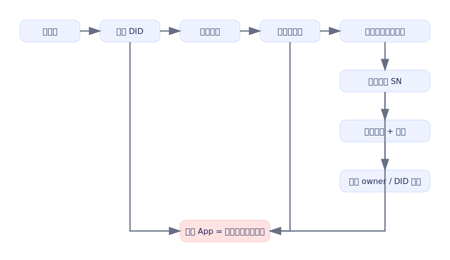
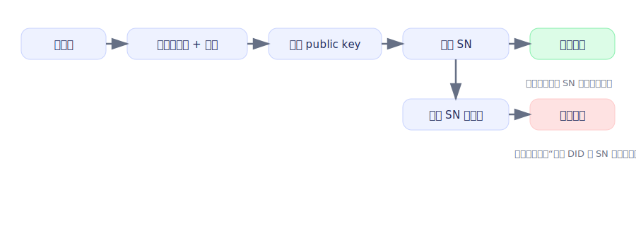
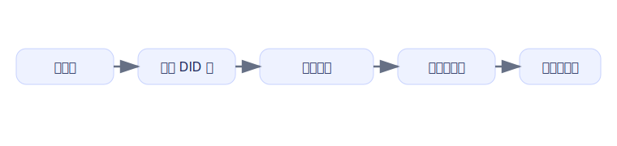
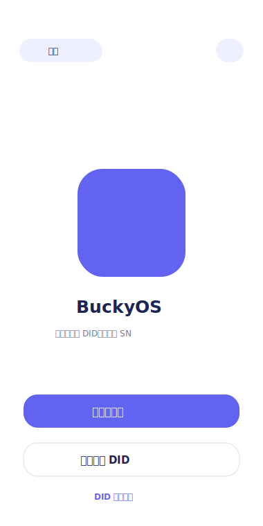
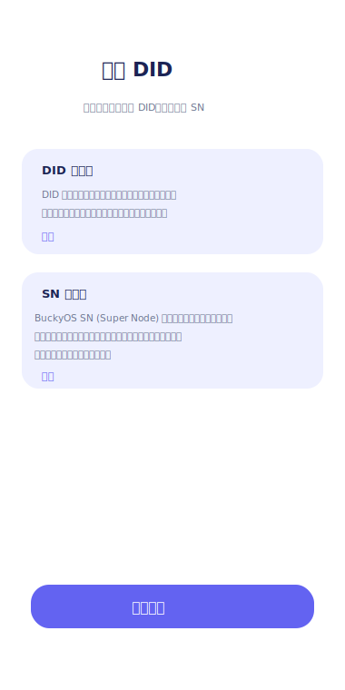
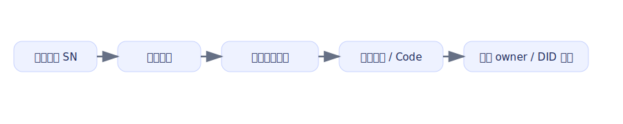
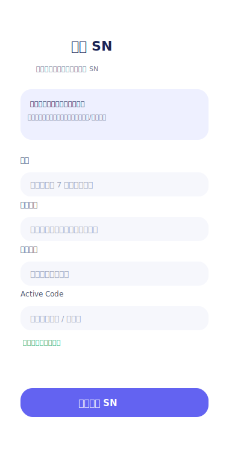
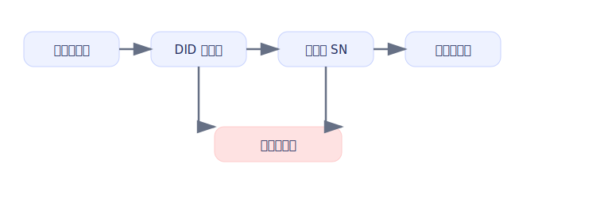

# DID与SN相关流程文档

## 1. 文档说明

本文档基于 [SN需求.md](./SN需求.md) 整理，重点覆盖以下两类身份入口：

- 创建流程中的 DID 创建阶段
- 创建流程中的 SN 绑定阶段
- 导入 DID 流程

本文档的目标不是复述全部 SN 规划，而是把新 App 在“创建 DID / 绑定 SN / 导入 DID”这几条关键身份链路中的页面结构、交互顺序、状态变化和实现边界整理成可直接用于产品、设计与开发对齐的流程说明。

## 2. 设计目标

新流程需要满足以下目标：

- 把“本地钱包创建”和“绑定 SN”拆成两个明确阶段。
- 让用户先获得自己的地址与助记词，再进入 SN/BNS 体系完成名字绑定。
- 让名字成为体系内主身份，而不是本地昵称或长地址。
- 保留用户名密码体系，作为 V1 默认主路径的一部分。
- 用 active code 承接当前阶段的防刷与平台开户引导。
- DID 创建和绑定 SN 是同一条创建流程中的两个阶段。
- 只有“创建 DID + 绑定 SN”都完成后，才算结束整次创建流程。
- 若用户在流程中途退出 App，则视为放弃本次创建流程。
- 导入 DID 时不再要求用户手动输入名字。
- 导入 DID 时必须通过公钥查询 SN 记录；查不到则导入失败。
- 导入成功后，直接使用 SN 上的名字作为该 DID 的昵称。

## 3. 核心术语

- DID：本地生成的身份与密钥材料集合，是整条创建流程的第一阶段产物。
- Name：用户在 SN/BNS 体系中的正式身份名，不等同于本地昵称。
- Owner：名字绑定的控制地址，默认应绑定到用户当前钱包地址。
- DID Document：名字绑定的低频身份文档，承载公钥、默认 zone 等关键信息。
- Active Code：当前阶段的绑定引导码，用于防刷和平台早期补贴承接。
- 统一账户密码：V1 默认保留的登录与恢复入口密码，在绑定 SN 阶段设置，同时也作为本地钱包保护密码使用。

## 4. 流程总览

新 App 中，创建 DID 和绑定 SN 不是两条彼此独立的流程，而是一条连续创建流程中的两个阶段。

- 第一阶段：创建 DID
  目标是生成本地身份、助记词和地址。
- 第二阶段：绑定 SN
  目标是注册名字、建立 owner 关系，并把名字绑定到 DID Document。

只有两个阶段都完成后，整条创建流程才算真正结束。



导入 DID 是另一条独立入口，但导入成功的前提是该 DID 已经在 SN 上存在记录。



## 5. 第一阶段：创建 DID

### 5.1 流程目标

该阶段只解决“生成本地身份”的问题，还不能视为整次创建已经完成。

完成后，用户应具备：

- 一组本地助记词
- 一组本地钱包地址 / 密钥
- 明确的备份确认

完成后，用户尚未具备：

- 体系内正式名字
- SN 账户状态
- owner 绑定关系
- 完整创建状态

### 5.2 流程原则

- 本地创建 DID 不依赖网络。
- 本地创建完成后，用户已经拥有地址。
- 助记词展示和确认必须保留。
- 创建 DID 页应尽量复用当前已实现的页面节奏，不做空泛说明页。
- 创建 DID 阶段不要求用户先输入密码。
- 统一密码在“绑定 SN”阶段设置。
- V1 不建议把“跳过密码”作为默认主路径。
- 若产品后续保留“跳过密码”，也只能作为受限模式，不能替代默认路径。
- 只有绑定 SN 成功，整次创建流程才算完成。
- 若用户在创建 DID 或绑定 SN 过程中主动退出 App，则视为放弃本次流程；未完成流程不保留继续创建态。

### 5.3 阶段流程



### 5.4 页面定义

#### 5.4.1 欢迎页

页面目标：

- 让用户理解当前入口是一条完整的创建流程。
- 明确告诉用户整个过程会分为“创建 DID”和“绑定 SN”两个阶段。

主操作：

- 创建账户
- 导入 DID

页面示意图：



#### 5.4.2 创建 DID 页

页面目标：

- 承接现有“创建 DID”页的角色，用简洁说明帮助用户理解当前步骤。
- 在不增加理解负担的前提下，告诉用户创建 DID 后还需要继续绑定 SN。

输入项：

- 无必填输入项

校验规则：

- 本页不做输入校验

辅助说明：

- 助记词是找回本地身份的唯一方式
- 完成 DID 创建后还需要继续绑定 SN，整次创建才算结束
- “DID 是什么”说明卡片中提供“详细”入口
- 点击“详细”后进入当前的 “DID 是什么” 页面
- “SN 是什么”说明卡片中也提供“详细”入口
- 点击“详细”后跳转到 [https://sn.buckyos.ai/](https://sn.buckyos.ai/)

建议文案方向：

- 主标题保持“创建 DID”
- 副文案用一句话解释：
  - DID 是你的本地身份
  - 绑定 SN 后才会成为可使用的体系身份

#### 5.4.3 创建 DID 引导页

页面目标：

- 作为创建 DID 页中的说明区域，而不是独立的空页面。
- 用简洁语言解释 DID 和 SN 分别是什么，以及两者的先后关系。

说明要求：

- 用用户能理解的语言说明：
  - DID 是你的本地身份
- 明确“先创建 DID，后绑定 SN”的节奏。
- 避免使用“开户”这类偏重术语。
- 底部按钮使用明确动作名，不使用“下一步：xxx”这种流程式命名。
- 有页面示意图时，不再额外保留 UI 简图。
- 在 “DID 是什么” 方框内增加 “详细” 入口，用于跳转到现有 DID 说明页。
- 在 “SN 是什么” 方框内增加 “详细” 入口，用于跳转到 [https://sn.buckyos.ai/](https://sn.buckyos.ai/)

页面示意图：



#### 5.4.4 助记词展示页

页面目标：

- 展示 12 个助记词。
- 强提示用户完成离线备份。

要求：

- 固定顺序展示。
- 提示“这是找回本地 DID 的唯一方式”。
- 不允许弱化备份风险。

#### 5.4.5 助记词确认页

页面目标：

- 确认用户已完成真实备份。

完成结果：

- DID 阶段完成。
- 生成本地地址与密钥材料。
- 自动进入绑定 SN 页，而不是直接把“账户已创建完成”作为最终终点。
- 如果用户此时退出 App，则视为放弃本次未完成创建流程。

### 5.5 流程结果

本阶段完成后，系统状态应为：

- 本地 DID 已生成
- 助记词已展示并确认
- 用户已拥有地址
- 账户状态为“创建进行中，待绑定 SN”
- 尚不能视为“账户创建完成”

## 6. 第二阶段：绑定 SN

### 6.1 流程目标

该阶段用于继续完成整次创建流程，让用户正式进入 SN/BNS 体系。

完成后，系统应实现：

- 注册一个合法且可用的名字
- 将名字 owner 绑定到用户当前钱包地址
- 用名字关联 DID Document
- 形成可用的体系身份
- 允许后续同时走“密码登录”和“密钥登录”

### 6.2 流程原则

- 名字是体系主身份，不再使用“昵称”作为核心身份标识。
- 绑定 SN 必须和 active code 绑定。
- V1 默认要求保留统一密码体系。
- 绑定 SN 成功后，整次创建流程才算真正完成。
- 需要兼容未来从平台辅助托管迁移到用户自持。
- 若用户在此阶段退出 App，则视为放弃本次未完成创建流程。

### 6.3 阶段主路径



### 6.4 页面定义

#### 6.4.1 绑定 SN 页

页面目标：

- 承接创建流程的第二阶段。
- 清楚告诉用户“继续完成创建，绑定 SN 后即可开始使用体系身份”。

输入项：

- 名字
- 统一密码
- 确认密码
- active code

名字规则：

- 统一合法性校验
- 长度至少 7 个字符
- 不允许重复
- 需要支持保留名 / 黑名单 / 高价值名字保护

交互要求：

- 名字校验应尽量前置
- active code 校验应有明确状态反馈
- 页面不使用“昵称”文案，统一使用“名字”
- SN 说明区域下方提供“详细”入口
- 点击“详细”后跳转到 [https://sn.buckyos.ai/](https://sn.buckyos.ai/)

页面示意图：



#### 6.4.2 绑定确认页

页面目标：

- 告知用户绑定动作的高价值属性。
- 明确本次提交会完成：
  - 名字注册
  - owner 绑定
  - DID Document 绑定

建议提示：

- 名字是体系内长期身份入口
- 后续将围绕名字而不是地址使用系统

#### 6.4.3 绑定成功页

页面目标：

- 告知用户已完成账户正式创建。

必须展示：

- 注册成功的名字
- 绑定的当前地址
- DID Document 已完成绑定
- 后续可通过密码登录或钱包密钥登录

UI 简图：

```text
+--------------------------------------------------+
| 绑定完成                                          |
|                                                  |
| 名字：myname123                                   |
| Owner：当前钱包地址                               |
| DID Document：已绑定                              |
|                                                  |
| 你现在可以：                                      |
| - 用密码登录                                      |
| - 用密钥登录                                      |
|                                                  |
| [ 进入首页 ]                                      |
+--------------------------------------------------+
```

## 7. 导入 DID

### 7.1 流程目标

导入 DID 用于恢复一个已经完成过 SN 绑定的身份。

导入成功后，系统应实现：

- 使用助记词恢复本地 DID
- 根据派生出的 Bucky 公钥查询 SN 记录
- 如果 SN 上存在记录，则直接读取对应名字
- 使用 SN 上的名字作为该 DID 的昵称
- 导入完成后自动设为当前身份

### 7.2 流程原则

- 导入 DID 时不要求用户输入名字
- 导入 DID 时只要求输入：
  - 助记词
  - 统一密码
- 必须先根据 public key 查询 SN
- 若 SN 上无记录，则视为该 DID 不符合导入条件，直接失败
- 只有查到 SN 记录，才允许完成导入

### 7.3 导入 DID 页

页面目标：

- 让用户通过助记词恢复已有身份
- 在导入阶段直接完成 SN 记录校验
- 避免用户手动输入昵称或名字

输入项：

- 助记词
- 统一密码
- 确认密码

不包含的输入项：

- 名字
- 昵称

页面提示要求：

- 需要明确告诉用户：只有已在 SN 上存在记录的 DID 才允许导入
- 若未查询到 SN 记录，需要展示明确失败提示

### 7.4 导入校验规则

- 助记词必须合法
- 统一密码必须符合长度要求
- 两次密码必须一致
- 助记词派生出的 public key 必须能在 SN 上查到记录
- 若查到记录，则直接使用 SN 返回的名字作为 DID 昵称
- 同一设备内不允许重复导入同一个 DID

### 7.5 失败提示

未查到 SN 记录时，使用固定失败提示：

- 当前 DID 在 SN 上无记录，导入失败

### 7.6 导入成功结果

导入成功后，系统状态应为：

- DID 已恢复到本地
- SN 名字已同步为该 DID 的昵称
- 当前导入的 DID 自动设为当前身份
- 用户可直接进入主界面

## 8. 关键状态与规则

### 8.1 创建状态机



### 8.2 名字规则

- 名字必须走统一合法性校验
- 长度不得少于 7 个字符
- 不得与已注册名字重复
- 需要保留名字与黑名单机制
- 高价值名字需要保护名单机制

### 8.3 密码规则

V1 使用同一个统一密码。

规则如下：

- 创建 DID 阶段不要求先设置密码
- 统一密码在“绑定 SN”阶段设置
- 该密码同时承担：
  - 本地钱包保护与解锁
  - `auth.register` / `auth.login` 所需的 `pwd_hash` 来源

V1 默认规则：

- 不允许把“跳过统一密码”作为主路径
- 如果存在“跳过密码”能力，也只能是受限纯钱包模式

### 8.4 完成态定义

只有满足以下条件，才算“账户创建完成”：

- 本地 DID 已创建
- 名字已成功注册
- owner 已绑定到用户钱包地址
- DID Document 已完成绑定
- 用户已具备密码登录和密钥登录能力

不满足以下任一项时，都不能视为创建完成：

- 仅完成 DID 创建但未绑定 SN
- 绑定 SN 过程中失败
- 用户在中途主动退出 App

## 9. 页面清单建议

建议将这两条流程落为以下页面：

- 欢迎页
- 创建 DID 页
- 创建 DID 引导页
- 助记词展示页
- 助记词确认页
- 绑定 SN 页
- 绑定确认页
- 绑定成功页
- 导入 DID 页

## 10. 接口建议

围绕这两条流程，V1 至少需要以下能力：

- 本地 DID 创建相关接口
  - 生成助记词
  - 校验助记词
  - 创建本地 DID
- 导入 DID 相关接口
  - 校验助记词
  - 根据助记词派生 public key
  - 根据 public key 查询 SN 记录
  - 导入 DID
- 绑定 SN 相关接口
  - 名字合法性与可用性校验
  - `auth.register(name, pwd_hash, active_code)`
  - `user.bind_owner_key(public_key)`
  - DID Document 绑定

### 10.1 钱包侧直接使用的 SN 接口

与 SN 相关的接口说明参考：

- [sn_json_rpc.md](/G:/WorkSpace/BuckyOSApp/doc/sn_json_rpc.md)

接口文档应以 `sn_json_rpc.md` 中的最新 namespaced 方法名为准，不再在本文档中使用旧的历史方法名。

结合当前钱包侧流程，直接相关的 SN 接口主要有以下几类：

#### 1. `auth.check_username`

用途：

- 在绑定 SN 时校验名字是否可用

当前钱包侧用途：

- 用户在“绑定 SN”页输入名字后做前置校验

推荐 path：

- `/kapi/sn/auth`

当前参数：

- `{ "name": "alice" }`

返回：

- `{ "code": 0, "valid": true }`

兼容关系：

- 旧名 `check_username` -> `auth.check_username`

#### 2. `auth.check_active_code`

用途：

- 校验 active code / 邀请码是否有效

当前钱包侧用途：

- 绑定 SN 前校验邀请码

推荐 path：

- `/kapi/sn/auth`

当前参数：

- `active_code`

返回：

- `{ "code": 0, "valid": true }`

兼容关系：

- 旧名 `check_active_code` -> `auth.check_active_code`

#### 3. `auth.register`

用途：

- 在绑定 SN 阶段先完成账号注册

当前钱包侧用途：

- 在创建流程第二阶段提交名字、密码摘要和 active code
- 获取后续 `user.bind_owner_key` 所需的 access token

推荐 path：

- `/kapi/sn/auth`

当前参数：

- `name`
- `pwd_hash`
- `active_code`

返回：

- `{ "code": 0, "access_token": "...", "refresh_token": "...", "need_bind_owner_key": true }`

说明：

- 这是新的账号注册入口
- `pwd_hash` 规则见 `sn_json_rpc.md`
- 当前约定为 `Base64(SHA256(password + username + ".buckyos"))`

#### 4. `user.bind_owner_key`

用途：

- 在 `auth.register` 之后，把当前 DID 对应的 owner 公钥绑定到用户记录

当前钱包侧用途：

- 完成“名字账户”和“当前 DID 公钥”之间的绑定

推荐 path：

- `/kapi/sn/bns`

当前参数：

- `{ "public_key": <jwk-object-or-string> }`

说明：

- 这是绑定 SN 主流程中的第二步
- 应在拿到 `auth.register` 返回的 access token 后调用

#### 5. `device.get_by_pk`

用途：

- 根据 public key 查询 SN 上是否存在对应身份记录

当前钱包侧用途：

- 首页查询当前 DID 的 SN 状态
- 绑定 SN 成功后轮询查询是否已生效
- 导入 DID 时，根据派生出的 public key 查询 SN 记录

推荐 path：

- `/kapi/sn`

当前参数：

- `public_key`

当前钱包侧关注的返回字段：

- `user_name`
- `zone_config`
- `found`
- `reason`
- `device_name`
- `device_info`
- `sn_ips`

说明：

- 对应旧 `get_by_pk`
- 钱包侧导入 DID、首页 SN 状态查询、绑定后确认都依赖这个接口

### 10.2 与钱包流程的接口对应关系

创建 DID 阶段：

- 不直接依赖 SN 接口

绑定 SN 阶段：

- 名字校验：`auth.check_username`
- active code 校验：`auth.check_active_code`
- 提交注册：`auth.register`
- 绑定 owner 公钥：`user.bind_owner_key`
- 绑定结果确认：`device.get_by_pk`

导入 DID 阶段：

- 助记词派生公钥后查询：`device.get_by_pk`
- 若查询结果未返回有效 `user_name`，则导入失败
- 若查询结果返回有效 `user_name`，则直接使用该名字作为 DID 昵称

### 10.3 当前文档建议

基于当前钱包流程，文档中建议把 SN 接口职责固定为：

- `auth.check_username`
  - 只负责名字可用性校验
- `auth.check_active_code`
  - 只负责邀请码有效性校验
- `auth.register`
  - 负责提交名字、`pwd_hash` 和 `active_code`
- `user.bind_owner_key`
  - 负责把当前 DID 的 owner 公钥绑定到用户记录
- `device.get_by_pk`
  - 作为查询 SN 身份状态的统一入口
  - 同时服务于首页状态查询、绑定结果确认、导入 DID 校验三类场景

## 11. 总结

新 App 中，“创建 DID”不再等于“账户已经创建完成”。

正确的新流程应为：

1. 先在本地创建 DID，获得助记词、地址和密钥。
2. 再完成绑定 SN，注册名字、绑定 owner、绑定 DID Document，并设置统一密码。
3. 只有两步都完成后，账户才算正式创建完成。
4. 如果用户中途退出 App，则视为放弃本次创建流程。
5. 导入 DID 时不再手动输入名字，系统必须先根据 public key 查询 SN；只有查到记录才允许导入，并直接使用 SN 名字作为昵称。

这份流程定义的核心变化有三点：

- 从“以 DID 为主”转向“以名字绑定为主”
- 从“本地创建完成即结束”转向“本地创建后继续完成绑定 SN”
- 从“创建 DID 时先设密码”转向“在绑定 SN 阶段统一设置一个密码”
