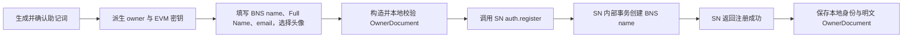

# SN 接口调整：用户创建流程 TODO

状态：已完成需求 Review，待实施  
日期：2026-07-09  
参考：`/Users/liuzhicong/project/cyfs-gateway/doc/SN/SN-API.md`

## 1. 结论与目标

> **核心产品定义：产品上看到的一个“用户身份”，在底层对应一份 OwnerDocument。**  
> BNS name 是这份 OwnerDocument 的可读名字和查找入口；owner 密钥与 EVM asset owner 是它的验证和控制基础。SN 账号、email、密码、active code 只负责注册和登录，不是用户身份本体。

因此，用户注册的首要目标调整为：**创建并发布一份符合要求的 OwnerDocument。** 具体做法是从同一份助记词生成 owner 与 EVM 两套密钥材料，构造完整、可验证的 OwnerDocument，再通过 SN 的 `auth.register` 原子注册同名 BNS name。

产品与底层对象的对应关系：

| 产品概念 | 底层含义 |
| --- | --- |
| 用户身份 | 一份以 `did:bns:<name>` 标识的 OwnerDocument |
| 用户名字 | BNS name；OwnerDocument 的名字和解析入口 |
| 身份验证密钥 | OwnerDocument 中的 owner Ed25519 公钥及其本地私钥 |
| 身份资产 owner | BNS name 的 EVM `assetOwner`，同时记录在 OwnerDocument wallet 中 |
| SN 账号 | 围绕该身份提供注册、登录和 zero-gas 服务的账号，不等于用户身份本体 |
| email / 密码 / active code | SN 本地注册与认证信息，不属于 OwnerDocument |
| 本地 DID 记录 | OwnerDocument、加密助记词和派生 wallet 的本地保存形态，不另造一套产品身份 |

页面上的“注册用户”本质是：

1. 用户在本地生成并备份助记词。
2. App 从助记词派生 owner 密钥和每个用户必备的 EVM/EVMP 密钥。
3. App 收集产品用户身份资料，构造与该用户身份一一对应的 `did:bns:<name>` OwnerDocument。
4. App 调用 SN `auth.register`，由 SN 代付 gas，将 BNS name 的 `assetOwner` 设为用户自己的 EVM 地址，并在同一笔 `registerName` 中发布 owner document。
5. App 等待 SN 注册接口返回；SN 成功返回即表示其内部注册事务已经完成、BNS name 已创建成功，然后 App 保存本地身份和 OwnerDocument。

本次不再使用以下旧路径：

- `user.bind_owner_key`：新版 SN API 已移除。
- `device.get_by_pk`：新版 SN API 已移除。
- `/kapi/sn/bns`：已下线，不等同于新的 `/kapi/sn/bns-proxy`。
- “先注册 SN 本地账号，再单独绑定 owner 公钥”的两段式流程。

后续页面、状态、缓存和接口命名都应遵守这一模型：**不能把 SN 本地账号、nickname、单独的 EVM 地址或本地 vault record 当成另一种用户身份。读取用户身份时以 OwnerDocument 为准。**

## 2. 已确认的接口事实

### 2.1 SN 注册接口

新版 `auth.register` 请求：

```json
{
  "name": "alice0001",
  "email": "alice@example.com",
  "pwd_hash": "...",
  "active_code": "...",
  "request_id": "sn:register:alice0001",
  "asset_owner": "0x...",
  "owner_config": {
    "id": "did:bns:alice0001",
    "...": "完整 OwnerDocument"
  }
}
```

关键语义：

- `email` 必填，由 SN 规范化并做全局唯一性校验；它属于 SN 本地账号数据，不写入公开 OwnerDocument。
- `asset_owner` 是用户自己的 EVM 地址；生产多 controller 配置下必填。
- `owner_config` 会作为固定的 `owner` document 随 `registerName` 原子发布；这里应传入完整 OwnerDocument，而不是只传 `{name, created_by}`。
- `initial_documents` 只支持可选的 `zone`、`boot`、`dns_txt`，不能再放 `owner`。
- SN 负责选择 controller、构造和提交交易；App 不传 controller、authority 或 raw calldata。
- 默认 `request_id` 虽然是 `sn:register:<username>`，App 仍应显式传入同样的确定性值，用于幂等重试。
- 本流程约定 `auth.register` 是 SN 内部事务：接口可能耗时较长，但只有 BNS name 创建成功后才返回注册成功；App 不再自行等待 BNS TX 或轮询 indexer。
- bns-proxy 是 SN 为 zero-gas 用户提供的内部实现方式，不改变上述成功语义。新 SN 注册不能退化为“只创建 SN 本地账号”；若 BNS 创建失败，整个注册必须失败。
- 如果当前 SN 实现或 `SN-API.md` 仍以 `status = submitted`、未启用 bns-proxy 时本地降级为成功，需要先由 SN 侧对齐上述产品契约，App 不为半完成注册增加补偿流程。

### 2.2 BNS 地址反查

BNS Client 已有 `name.query_by_addr`，新版 WebSDK 对应：

```ts
const page = await bnsClient.queryNamesByAddress(evmAddress, null, 100);
```

返回的是该 EVM 地址当前作为 `asset_owner` 持有的 BNS name 列表，并支持分页。新导入流程应使用该接口替换旧的“按 owner 公钥查 SN 用户”。

注意：地址反查只证明 EVM 地址持有 name。导入时还需要读取 `owner` document，并校验其中的 owner Ed25519 公钥是否和同一助记词派生的 owner 公钥一致。

### 2.3 当前依赖能力

| 能力 | BuckyOSApp 当前锁定依赖 | 新版 `buckyos-websdk` beta2.2 | 处理建议 |
| --- | --- | --- | --- |
| 新 SN 路由与 `auth.register` 新字段（含必填 email） | 无 | `sn.SnClient.register` 已有 | 升级到最新版后直接使用 WebSDK |
| BNS 地址反查 | 无 | `bns.BnsClient.queryNamesByAddress` 已有 | 升级后直接使用 WebSDK |
| OwnerDocument 构造 | 无 | `namelib.newOwnerDocument` 已有 | 升级后复用，不在 App 手写基础 DID schema |
| 生产助记词派生 owner/EVM 密钥 | 无 | 没有公开生产 API；只有明确标为 dev-only 的测试实现 | 继续在 Tauri/Rust 中使用 `name-lib` 派生，不把私钥带到 WebView |
| DiceBear 头像 | `avatar` 为字符串 | `avatar` 为字符串 | 使用 `$method:$string`，例如 `dicebear:$seed`，由 UI 解释 |
| 注册 email | 当前调用未传 | 最新 `SnAuthRegisterReq.email` 为必填 | 传给 SN；不写入 OwnerDocument |

当前 App 锁定的 WebSDK commit 为 `9075dd6894a76f6183e9ebda7f0a552a506d1b99`，不含上述新版 SN/BNS/OwnerDocument API。实施时必须更新到最新版，并将最终解析出的版本/commit 写入 lockfile，保证构建可复现。

## 3. 密钥派生与本地保存

同一份助记词至少派生两套 index 0 密钥：

| 用途 | 算法/路径 | 对外使用 | 本地保存要求 |
| --- | --- | --- | --- |
| owner 密钥 | `name_lib::derive_bucky_key_from_mnemonic`（定义于 utility） | 公钥 JWK 写入 OwnerDocument 的 `verificationMethod[0].publicKeyJwk` | 私钥不得进入 JS、日志或 OwnerDocument；由加密助记词按需恢复 |
| EVM/EVMP 密钥 | `name_lib::derive_evm_key_from_mnemonic`（定义于 utility） | 地址写入 SN `asset_owner` 和 OwnerDocument `wallets` | 私钥不得进入 JS、日志或 OwnerDocument；由加密助记词按需恢复 |

owner 与 EVM/EVMP 密钥的算法、derivation path、index 和输出格式以 `name-lib` 的 utility 辅助函数为唯一事实来源，App 不复制或重写派生逻辑。

实现 TODO：

- [ ] 将 `DidDerivationPlan::default_requests()` 从仅 `bucky(1)` 调整为 `bucky(1) + eth(1)`。
- [ ] 新增/替换 Tauri command，例如 `derive_registration_material`，只向前端返回 owner public JWK、公用 EVM 地址与 derivation index/path，不返回任何私钥。Owner DID 由归一化后的 BNS name 构造为 `did:bns:<name>`，不是从密钥派生的 `did:dev`。
- [ ] `create_did`、`import_did` 默认同时生成并保存 `bucky_wallets[0]` 与 `eth_addresses[0]`。
- [ ] 私钥继续由加密助记词按需派生；不得新增明文 EVM 私钥持久化。
- [ ] 为 owner/EVM 派生增加固定助记词测试向量，防止路径或算法在升级依赖后静默变化。

## 4. OwnerDocument 构造（产品用户身份本体）

OwnerDocument 不是注册流程的附属资料，而是产品“用户身份”在底层的正式对象。没有成功构造并发布 OwnerDocument，就不能认为用户身份已经创建；仅创建 SN 本地账号、生成密钥或占用 BNS name 都不算完成。

### 4.1 字段映射

OwnerDocument 至少包含：

| 产品信息 | OwnerDocument 字段 | 说明 |
| --- | --- | --- |
| BNS name | `id = did:bns:<name>`、`name` | `name` 使用 SN 归一化后的值 |
| owner 公钥 | `verificationMethod[0].publicKeyJwk` | Ed25519 JWK；同时保留标准 authentication/assertion/capability 字段 |
| Full Name | `display_name` | 必填；`name-lib` 当前规范字段是 `display_name`，反序列化兼容旧 `full_name`；UI 标签显示 Full Name/全名 |
| 头像 | `avatar` | 必填字符串，统一为 `$method:$string`；DiceBear 使用 `dicebear:$seed`，由 UI 解释和渲染 |
| EVM 地址 | `wallets.main = {type: "eth", address: "0x..."}` | 地址同时作为 SN `asset_owner`；提交前校验二者一致 |

确定的结构：

```json
{
  "@context": [
    "https://www.w3.org/ns/did/v1",
    "https://buckyos.org/ns/owner/v1"
  ],
  "id": "did:bns:alice0001",
  "verificationMethod": [
    {
      "type": "Ed25519VerificationKey2020",
      "id": "#main_key",
      "controller": "did:bns:alice0001",
      "publicKeyJwk": {
        "kty": "OKP",
        "crv": "Ed25519",
        "x": "..."
      }
    }
  ],
  "authentication": ["#main_key"],
  "assertion_method": ["#main_key"],
  "capabilityInvocation": ["#main_key"],
  "exp": 2098915200,
  "iat": 1783555200,
  "version_seq": 0,
  "name": "alice0001",
  "display_name": "Alice Zhang",
  "avatar": "dicebear:alice-avatar-01",
  "wallets": {
    "main": {
      "type": "eth",
      "address": "0x..."
    }
  }
}
```

构造 TODO：

- [ ] 使用新版 WebSDK `namelib.newOwnerDocument` 生成基础字段，避免 App 自己复制 DID schema、时间戳和默认有效期逻辑。
- [ ] 在基础 document 上补齐 `avatar = "dicebear:<seed>"` 与 `wallets.main`。
- [ ] 增加统一 `validateOwnerDocumentForRegistration`：校验 DID/name 一致、owner JWK 格式、EVM 地址格式、`asset_owner` 一致、Full Name 非空和 avatar 符合 `$method:$string`。
- [ ] 在提交 SN 前序列化一次并校验 owner document 小于单文档 4KB 上限。
- [ ] OwnerDocument 只包含公开信息，不得包含 email、助记词、owner 私钥、EVM 私钥、密码 hash、active code 或 SN token。
- [ ] 对 OwnerDocument 做 snapshot/round-trip 测试，确保 WebSDK 与 Rust `name-lib` 可互相反序列化。
- [ ] 将注册成功使用的完整 OwnerDocument 原文保存在本地；OwnerDocument 是公开数据，不加密。

## 5. 新建用户目标流程



### 5.1 页面与状态

- [ ] 在现有绑定 SN 页面补充或新增“身份资料”步骤：头像选择、Full Name、电子邮箱、只读 EVM 地址预览。
- [ ] Full Name 和 email 必填；name、Full Name、email 等输入在提交前统一 trim，name 使用 SN 返回的 `normalized_name`，email 由 SN 做最终规范化和唯一性校验。
- [ ] DiceBear seed 在本地生成或由用户选择，OwnerDocument 只保存选中的 `avatar = "dicebear:<seed>"`。
- [ ] EVM 地址只读展示，并提示它是 BNS name 的资产 owner 地址。
- [ ] 提交按钮文案表达“注册名字并创建身份”，不再表达为单独绑定 owner key。
- [ ] 注册状态使用 `preparing`、`submitting`、`succeeded`、`failed`；`submitting` 可能持续较长时间，期间禁用重复提交并给出明确进度提示。

### 5.2 注册前本地准备

- [ ] 并行调用 `auth.check_username`、`auth.check_active_code` 和本地密钥派生；提交时仍以 `auth.register` 的最终结果为准。
- [ ] 使用归一化 name 计算密码 hash。
- [ ] 使用确定性的 `request_id = sn:register:<normalized-name>`；超时或失败重试时复用，不引入额外 pending registration 存储。

### 5.3 调用 SN

- [ ] 用新版 WebSDK `sn.SnClient` 替换 App 内手写的旧 `SnAuthClient`、`SnBindingClient`、`SnDeviceClient`。
- [ ] `auth.register` 传入：
  - `name`
  - 必填 `email`
  - `pwd_hash`
  - `active_code`
  - 稳定的 `request_id`
  - `asset_owner = derived EVM address`
  - `owner_config = complete OwnerDocument`
  - `initial_documents`：首期没有 zone/boot/dns_txt 时省略，不传空的 owner
- [ ] 删除注册成功后调用 `user.bind_owner_key` 的逻辑。
- [ ] 不再轮询 `device.get_by_pk`。
- [ ] 将新版 SN 错误码映射到页面：`invalid_params`、`invalid_email`、`email_already_bound`、`username_already_exists`、`invalid_active_code`、`bns_permission_denied`、`bns_name_already_exists`、`bns_write_failed`、`bns_proxy_unavailable`、`bns_controller_unavailable`。
- [ ] 为 `auth.register` 使用适合内部事务的长超时；SN 成功返回后直接进入本地保存，不再使用 `bns.tx_hash` 做客户端二次确认。
- [ ] 成功响应仍应满足 `need_bind_owner_key == false`；若出现 `true`，视为 SN 未遵守新注册契约并报错。

### 5.4 SN 返回后的本地保存

- [ ] SN 返回成功后调用本地 create/finalize，一次性保存加密助记词、owner/Bucky wallet、EVM wallet、SN name/status 和本次注册使用的 OwnerDocument。
- [ ] OwnerDocument 按原始 JSON 明文保存；它是公开身份文档，不进入 mnemonic 加密字段。
- [ ] 本地写入成功后才显示“账户创建成功”。
- [ ] SN 调用失败或超时时不标记本地身份为 active；重试使用相同 name、密钥材料、OwnerDocument 和确定性 request id。

## 6. 导入/恢复流程

导入的目标是从 BNS 找回产品用户身份对应的 OwnerDocument，并在验证它确实属于当前助记词后保存到本地。新导入流程不再按 owner public key 查询 SN：

1. 校验助记词。
2. 从助记词派生 owner public JWK 和 EVM index 0 地址。
3. 调用 BNS `queryNamesByAddress(evmAddress)` 获取 name 列表。
4. 逐个读取候选 name 的 `owner` document，筛选 owner 公钥与派生公钥一致的记录。
5. 唯一匹配时使用 BNS name 作为本地昵称并导入；多个匹配时让用户选择；无匹配时直接导入失败。
6. 将从 BNS 获取并验证通过的完整 OwnerDocument 明文保存到本地。

实现 TODO：

- [ ] 删除 `getUserByPublicKey`、`device.get_by_pk` 及其旧返回结构依赖。
- [ ] 按统一根域配置构造 BNS endpoint：SN 使用 `sn.<sn_host>`，BNS 使用 `bns.<sn_host>`；通过最新版 WebSDK `BnsClient` 发起分页地址查询。
- [ ] 处理同一 EVM 地址持有多个 BNS name 的正常场景，不能默认取第一页第一项。
- [ ] 校验候选 owner document 的 owner 公钥；只按 EVM 地址匹配不足以证明助记词与 OwnerDocument 完整一致。
- [ ] 导入成功后默认生成 owner+Bucky 与 EVM 两套 wallet 记录。
- [ ] 导入成功时保存从 BNS 获得的完整 OwnerDocument，不能只保存 name 或 public key。
- [ ] SN 登录态与 BNS 身份恢复分开：BNS 找到身份不等于已经恢复 SN password/access token；需要时再走 `auth.login`。
- [ ] 本版本是 breaking change，不提供旧 SN public-key 记录兼容或存量迁移；查不到 BNS name 或 OwnerDocument 即导入失败。

## 7. 代码改造清单

### 7.1 前端

- [ ] `src/features/did/useDidFlow.ts`：扩展表单状态、构造 OwnerDocument、调用 SN 长事务注册，并在成功后完成本地保存。
- [ ] `src/pages/did/BindSn.tsx`：增加 avatar、Full Name、email、EVM 地址展示及字段校验。
- [ ] `src/features/did/types.ts`：补 registration material、OwnerDocument form、SN register response 与本地 OwnerDocument 类型，减少 `any`。
- [ ] `src/features/sn/snStatusManager.ts`：删除“绑定后按公钥轮询”，SN 注册成功后直接缓存 name/status。
- [ ] `src/services/sn_client.ts`：升级后尽量删除自维护协议类型，改为薄封装 WebSDK `SnClient`；保留 App 级 timeout、错误翻译和配置注入。
- [ ] 新增 BNS service 薄封装，仅用于导入时的地址分页反查和 OwnerDocument 读取/解析。
- [ ] 所有语言补齐 avatar、必填 Full Name、email、EVM owner、SN 长事务等待和错误文案。

### 7.2 Tauri/Rust

- [ ] `src-tauri/src/did/identity.rs`：默认派生 Bucky+EVM 两套 index 0 wallet。
- [ ] `src-tauri/src/did/commands.rs`：新增只返回公开注册材料的 command；create/import 接收并保存完整 OwnerDocument。
- [ ] `src-tauri/src/did/store.rs`：在 `StoredDid` 中保存未加密 OwnerDocument；助记词继续使用现有加密存储。
- [ ] `src-tauri/src/config.rs`：将 `sn_host` 明确为统一根域，并集中构造 `sn.<sn_host>` 与 `bns.<sn_host>` 的 HTTPS API URL。
- [ ] 对所有敏感 command 参数和错误实现日志脱敏。

### 7.3 依赖

- [ ] 将 `buckyos-websdk` 升级到最新版，确认包含必填 email 的 `sn_client`、`bns_client`、`namelib.newOwnerDocument`，并更新两份 lockfile。
- [ ] 做一次 WebSDK 升级兼容清单；当前锁定版本与 beta2.2 新实现存在较大差异，不能只替换 commit 后直接提交。
- [ ] 确认 Rust `name-lib` 版本中的类型名称（旧版 `OwnerConfig`、新版 `OwnerDocument`）与 JSON schema 一致，避免只因类型重命名产生双实现。
- [ ] 密钥派生固定复用 Rust `name-lib::utility` 辅助函数；不得使用或复制 WebSDK 的 `dev_test_keys.ts`。
- [ ] 联调前确认 SN 已实现“BNS name 创建成功才返回 `auth.register` 成功”的内部事务语义，并同步修正仍描述 `submitted`/本地降级的接口文档或实现。

## 8. 安全与隐私 TODO

- [ ] 不记录 mnemonic、owner/EVM 私钥、password/password hash、active code、完整 access/refresh token。
- [ ] 移除当前检查 active code 时输出明文 active code 的日志。
- [ ] email 只发送给 SN 并作为 SN 本地账号数据保存，禁止加入公开 OwnerDocument。
- [ ] 日志中的 EVM 地址、owner public key、email 和完整 OwnerDocument 按产品隐私要求截断或脱敏；本地 OwnerDocument 虽不加密，也不得无必要写入日志。
- [ ] OwnerDocument 在提交前做结构、字段长度与 4KB 大小限制，避免注册交易因文档不合法失败。
- [ ] 本地 OwnerDocument 作为公开数据明文保存；助记词与私钥材料继续加密，两者存储边界必须清晰。
- [ ] SN timeout 或网络断开后允许使用相同确定性 `request_id` 重试，不能生成新的密钥材料或 OwnerDocument。

## 9. 测试与验收

### 9.1 单元测试

- [ ] 固定助记词派生 owner public JWK、EVM 地址的测试向量，并单独验证归一化 name 到 `did:bns:<name>` 的构造。
- [ ] OwnerDocument 完整结构 snapshot：必填 Full Name、`avatar = "dicebear:<seed>"`、EVM wallet 均存在，email 和私钥均不存在。
- [ ] SN register request snapshot：必填 email、路径和 `asset_owner`/`owner_config`/`request_id` 正确，不再调用旧 API。
- [ ] email 为空、格式非法、已绑定时分别映射 `invalid_email`、`email_already_bound` 等正确错误。
- [ ] BNS 地址分页、零/一/多个 name、owner 公钥不匹配等场景。
- [ ] avatar `$method:$string` 解析，以及未知 method 的 UI 降级显示。

### 9.2 集成测试

- [ ] 正常链路：助记词 → 两套密钥 → OwnerDocument → SN 内部事务注册 BNS name → SN 返回成功 → 本地保存身份和 OwnerDocument。
- [ ] SN 内部 BNS 注册失败时 `auth.register` 整体失败，不创建半完成的 SN 用户。
- [ ] SN 注册耗时较长时 UI 保持 submitting 状态，不重复提交、不提前成功。
- [ ] SN timeout 后使用相同 `request_id` 重试，不产生第二个账号或 BNS name。
- [ ] 导入同一助记词能够通过 EVM 地址找回 name，获取并验证 OwnerDocument，然后将其保存到本地。
- [ ] 查不到 BNS name、查不到 OwnerDocument 或 owner 公钥不匹配时导入失败，不走 legacy fallback。
- [ ] 同一地址多个 name 时可选择正确身份。

### 9.3 完成标准

- [ ] 产品中的每个用户身份都明确对应一份 `did:bns:<name>` OwnerDocument；代码和 UI 不把 SN 账号或本地 nickname 当成独立身份源。
- [ ] 新用户本地必有 owner 与 EVM 两套可恢复密钥材料。
- [ ] BNS `asset_owner` 是用户派生的 EVM 地址，不是 SN controller 地址。
- [ ] BNS 上存在完整且可由标准 resolver 读取的 OwnerDocument。
- [ ] OwnerDocument 包含必填 Full Name、`dicebear:<seed>` 头像和 EVM 地址，不包含 email。
- [ ] `auth.register` 请求包含必填 email，SN 负责规范化、格式校验和唯一性约束。
- [ ] SN 只有在内部 BNS name 创建成功后才返回注册成功；App 无需等待或查询 BNS TX。
- [ ] 本地保存完整明文 OwnerDocument，导入时也必须从 BNS 获得并保存 OwnerDocument。
- [ ] 注册流程不再调用任何已移除的 SN API。
- [ ] 导入流程不依赖旧 SN public-key 反查。
- [ ] SN 未成功返回或本地保存失败时，不显示“账户创建成功”。

## 10. 建议实施顺序

1. 升级到最新版 WebSDK/name-lib，并先对齐 SN `auth.register` 的必填 email 和内部事务成功语义。
2. 跑通 utility 双密钥测试向量、OwnerDocument round-trip 与 `avatar = "$method:$string"`。
3. 改 Tauri 默认派生及 OwnerDocument 本地明文存储。
4. 改 SN 注册调用，删除旧 bind/get-by-pk、pending 和客户端 BNS TX 确认路径。
5. 接 BNS 地址反查、OwnerDocument 获取与 breaking-change 导入流程。
6. 完成 UI、i18n 和端到端测试。
