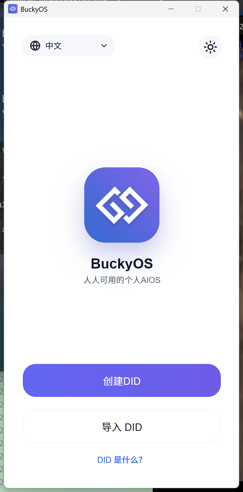
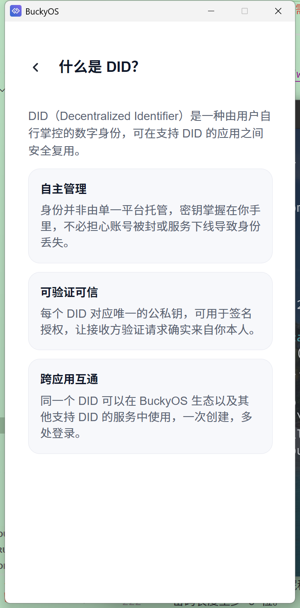
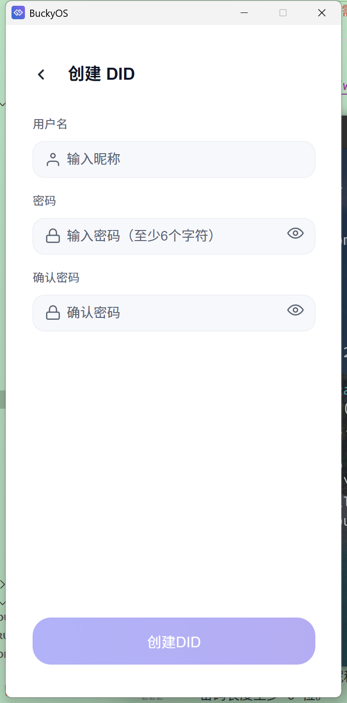
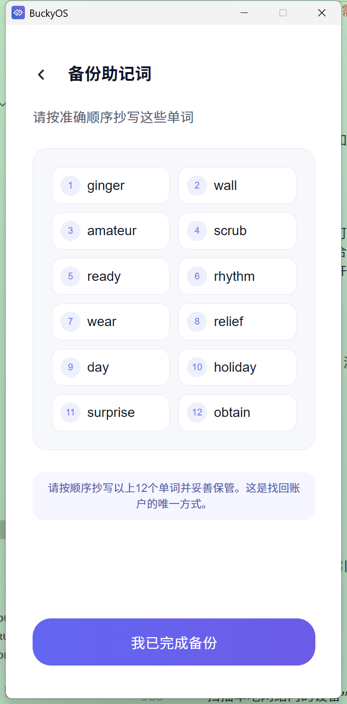
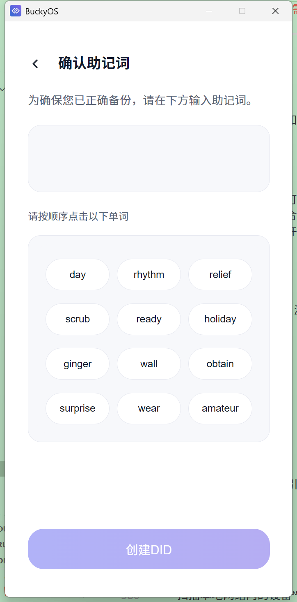
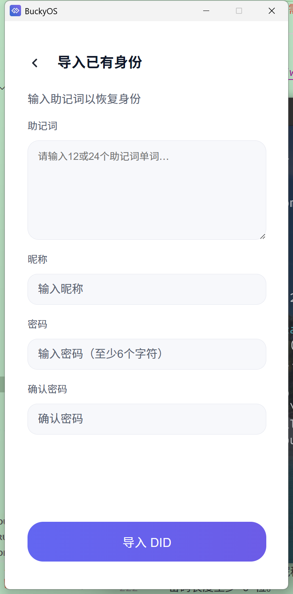
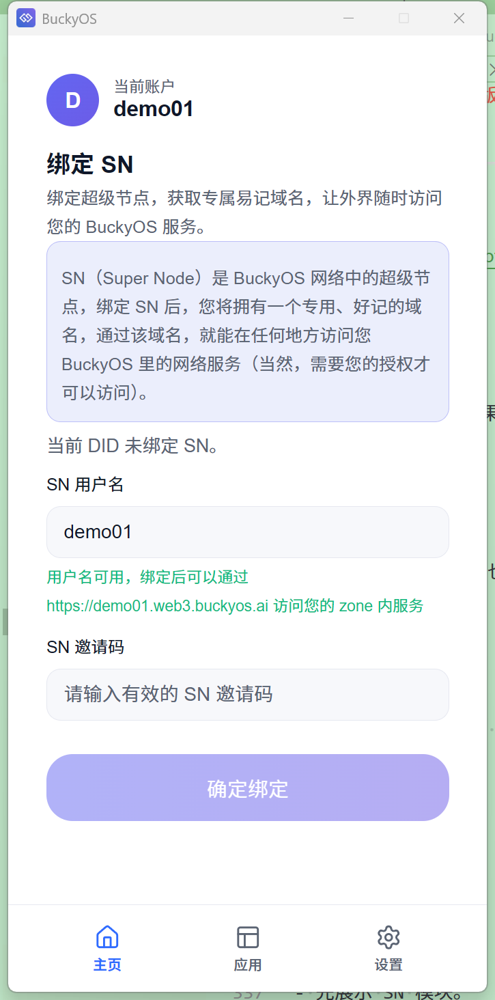
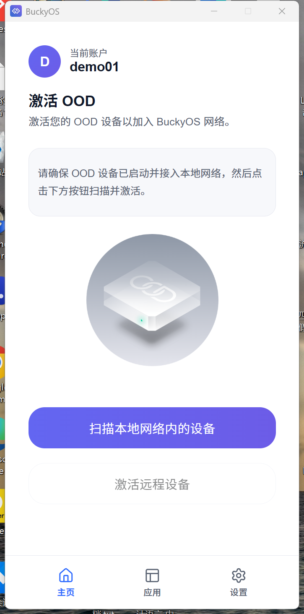
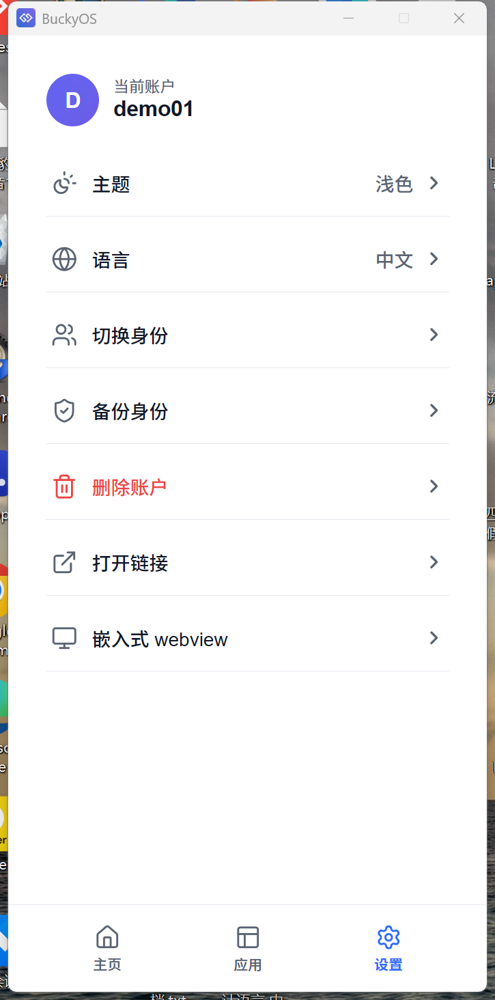

# BuckyOS App 当前版本需求文档（中文）

## 1. 文档说明

本文档仅基于当前仓库代码与现有文档整理，不补充尚未落地的规划能力，不引入超出当前实现范围的产品设想。

文档目标有两点：

- 让开发者、设计师、测试人员基于同一份说明理解当前产品应该具备的 UI、流程与功能边界。
- 让其他 AI Agent 在继续迭代时，能做出与当前产品一致的页面结构、交互模式和功能行为。

### 1.1 截图说明

本文档中的页面截图优先来自真实运行的 Tauri 应用窗口，用于约束页面结构、视觉层级和控件位置。

- 截图优先选取不依赖运行态身份数据的关键页面。
- 截图用于 UI 对齐，不额外代表新的产品需求。
- 若后续页面结构发生变化，应同步更新对应截图。

## 2. 产品定位

### 2.1 核心定位

BuckyOS App 是一个宿主应用，当前版本承担两项明确职责：

- 管理用户身份：围绕 DID 完成创建、导入、切换、备份、删除，以及与 SN 状态相关的信息管理。
- 提供 Runtime：为 OOD 内 Web App 或外部 Web 页面提供统一运行容器，并通过 `BuckyApi` 暴露受控宿主能力。

### 2.2 Runtime 范围

Runtime 在当前项目中的目标范围明确为：

- 给 OOD 内 Web App 提供运行容器。
- 给嵌入式 iframe 或独立 WebView 中运行的页面注入宿主能力接口。

Runtime 当前不包含以下内容：

- 本地 native app 的完整生命周期管理。
- 应用安装、升级、卸载、守护、系统服务编排。
- 通用权限中心或复杂授权管理系统。

## 3. 当前功能范围

### 3.1 已实现范围

- 首次启动引导。
- DID 创建。
- DID 导入。
- 助记词展示与确认。
- DID 列表与身份切换。
- 助记词备份。
- DID 删除。
- SN 状态查询、用户名校验、邀请码校验、SN 注册绑定。
- OOD 激活入口与局域网设备扫描。
- App 列表读取与展示。
- 独立 WebView 打开。
- 嵌入式 iframe Runtime。
- `BuckyApi` 注入与消息桥接。
- `getPublicKey`、`getCurrentUser`、`signJsonWithActiveDid` 三个宿主接口。

### 3.2 未包含范围

- App 安装、升级、卸载。
- OOD 激活完成后的完整配置写入流程说明。
- 更复杂的应用权限授权弹窗体系。
- 除当前三项以外的更多宿主开放能力。

## 4. 术语定义

- DID：去中心化身份，是本应用的核心身份对象。
- Active DID：当前激活身份，主界面、SN 查询、签名能力都以它为准。
- Bucky Wallet：DID 下的 Bucky 身份钱包，包含 DID 标识与公钥信息。
- SN：与用户名注册及按公钥查询用户信息相关的远端服务。
- OOD：用户的设备节点，当前版本主要围绕“发现并打开激活页”。
- Runtime：宿主提供给 Web 页面运行的容器。
- `BuckyApi`：宿主注入给页面的 JS 接口。

## 5. 产品信息架构

### 5.1 一级结构

应用分为两套主流程：

- DID 引导流：用于首次创建或导入身份。
- 主应用流：用于首页、应用页、设置页及相关二级页面。

### 5.2 路由结构

#### DID 引导流

- `/`：欢迎页。
- `/did-info`：DID 说明页。
- `/import`：导入 DID。
- `/create`：创建 DID。
- `/show-mnemonic`：展示助记词。
- `/confirm-mnemonic`：确认助记词。
- `/success`：创建成功页。

#### 主应用流

- `/main/home`：首页。
- `/main/home/ood-activate`：OOD 激活入口页。
- `/main/home/ood-scan`：设备扫描页。
- `/main/apps`：应用列表页。
- `/main/setting`：设置页。
- `/main/setting/identities`：身份切换页。
- `/main/setting/backup`：身份备份页。
- `/main/setting/language`：语言设置页。
- `/main/setting/embedded-webview`：嵌入式 WebView 调试页，仅开发环境使用。
- `/web-container`：独立窗口中的 Runtime 容器页。

### 5.3 首页 Tab 结构

主应用流的一级 Tab 只有三个：

- 首页
- 应用
- 设置

TabBar 仅在以下路径显示：

- `/main`
- `/main/home`
- `/main/home/ood-activate`
- `/main/apps`
- `/main/setting`

其他二级详情页不显示 TabBar。

## 6. 全局状态规则

### 6.1 启动判定

- 启动后若本地没有任何 DID，进入 DID 引导流。
- 启动后若已有 DID，则直接进入主应用流。

### 6.2 Active DID 规则

- 创建 DID 后，自动设为 Active DID。
- 导入 DID 后，自动设为 Active DID。
- 手动切换 DID 后，所有依赖身份的展示与接口都应以新 Active DID 为准。
- 如果存在 DID 但没有 Active DID，用户进入主应用时应被强制跳转到身份切换页。

### 6.3 DID 上下文规则

以下模块都以 Active DID 为当前身份来源：

- 顶部账户头部显示。
- 首页 SN 状态与 OOD 状态。
- `BuckyApi.getPublicKey`。
- `BuckyApi.getCurrentUser`。
- `BuckyApi.signJsonWithActiveDid`。

### 6.4 SN 状态缓存规则

- SN 状态需和 DID 绑定保存。
- 本地存在缓存时优先读取缓存。
- 必要时再向远端查询。
- 缓存内容至少包括用户名与 zone_config。

## 7. 页面级需求

## 7.1 欢迎页

### 页面目标

为首次用户提供清晰入口，决定是创建 DID 还是导入 DID。

### 页面组成

- 左上角语言切换。
- 右上角主题切换。
- 中央 App 图标。
- 应用名称与副标题。
- 主按钮“创建 DID”。
- 次按钮“导入 DID”。
- 底部文字按钮“DID 是什么？”。

### 交互要求

- 点击“创建 DID”进入创建流程。
- 点击“导入 DID”进入导入流程。
- 点击“DID 是什么？”进入 DID 说明页。
- 主题切换直接生效。
- 语言切换直接生效。

### 页面截图



## 7.2 DID 说明页

### 页面目标

用静态说明帮助用户理解 DID 的含义与价值。

### 内容要求

- 说明 DID 是去中心化身份。
- 至少涵盖“自主掌控”“可验证可信”“跨应用复用”三类说明点。

### 页面截图



## 7.3 创建 DID 页

### 页面目标

让用户输入创建 DID 所需基础信息。

### 输入项

- 昵称
- 密码
- 确认密码

### 校验规则

- 昵称长度必须在 5 到 20 个字符之间。
- 昵称不能与现有 DID 昵称重复。
- 密码长度至少 6 位。
- 两次密码必须一致。

### 按钮状态

- 只有当昵称合法、昵称不重复、密码合法且两次一致时，“创建 DID”按钮可点击。

### 当前版本限制

- 创建页不包含 SN 绑定。
- 创建页不包含邀请码输入。

### 页面截图



## 7.4 展示助记词页

### 页面目标

向用户展示新生成的助记词，并要求用户完成备份。

### 展示要求

- 12 个助记词按固定顺序展示。
- 使用清晰的网格结构展示编号与单词。
- 页面需明确提示“这是找回账户的唯一方式”。

### 主操作

- 用户点击“我已完成备份”进入助记词确认页。

### 页面截图



## 7.5 确认助记词页

### 页面目标

确保用户已真实完成助记词备份。

### 交互要求

- 页面提供已打乱顺序的单词池。
- 用户按顺序点击单词构造完整助记词。
- 已选择的单词显示在上方区域。
- 用户可点击已选择单词撤回。

### 校验规则

- 只有当用户选择顺序与原始助记词完全一致时，确认按钮可点击。
- 一旦出现顺序错误，应给出错误提示。

### 页面截图



## 7.6 导入 DID 页

### 页面目标

允许用户通过助记词恢复已有身份。

### 输入项

- 助记词文本框
- 昵称
- 密码
- 确认密码

### 校验规则

- 助记词不能为空。
- 助记词中的已完成输入单词可调用后端做合法性校验。
- 昵称不能为空。
- 昵称长度必须在 5 到 20 个字符之间。
- 两次密码必须一致。
- 密码长度至少 6 位。

### 后端约束

- 不允许导入重复身份。
- 不允许使用重复昵称。

### 页面截图



## 7.7 创建成功页

### 页面目标

展示 DID 创建成功结果，并进入主应用流。

### 展示内容

- 昵称
- Bucky DID
- 如当前实现可取到，也可展示 BTC / ETH 地址信息

## 7.8 主应用首页

### 页面目标

围绕当前 Active DID 展示身份绑定状态与下一步动作。

### 页面结构

- 顶部账户头部
- SN 模块
- OOD 模块

### 显示逻辑

- 先展示 SN 模块。
- 只有当 SN 已注册且 SN 查询成功时，才显示 OOD 模块。

### 页面截图



## 7.9 首页 SN 模块

### 页面目标

展示当前 DID 的 SN 状态，并支持注册绑定。

### 状态分支

- 无 Active DID：提示先创建或导入 DID。
- 正在查询：显示加载状态。
- 查询失败：显示失败提示与重试按钮。
- 已注册：隐藏注册表单。
- 未注册：显示用户名与邀请码输入表单。

### 用户名规则

- 只允许小写字母、数字、连字符。
- 长度 5 到 20。
- 必须以字母或数字开头和结尾。
- 输入时自动转小写。

### 输入交互

- 用户名输入后延迟校验可用性。
- 邀请码输入后延迟校验合法性。
- 两项都校验通过后才允许点击绑定。

### 绑定成功行为

- 弹出成功确认框。
- 成功确认后跳转到 OOD 激活页。

### 绑定失败行为

- 显示失败信息。
- 弹出失败确认框。

## 7.10 OOD 激活入口页

### 页面目标

在已具备 SN 的前提下，引导用户扫描局域网设备完成后续激活。

### 页面组成

- 标题与副标题。
- OOD 说明文案。
- 插图。
- “扫描本地网络内的设备”主按钮。
- “激活远程设备”次按钮。

### 当前版本限制

- “激活远程设备”按钮为禁用状态，仅提示“即将支持”。

### 页面截图



## 7.11 首页 OOD 状态展示

### 展示逻辑

- 若 SN 状态中包含有效的 `zone_config`，视为已绑定 OOD。
- 已绑定时首页显示“已绑定 OOD”的静态状态卡片。
- 未绑定时显示 OOD 激活入口模块。

## 7.12 设备扫描页

### 页面目标

扫描当前局域网，发现可用于激活的设备。

### 扫描规则

- 先读取本机 IPv4 地址列表。
- 过滤 `127.*`。
- 若存在非 `172.*` 地址，则优先排除 `172.*` 地址。
- 按本机网段构造扫描目标。
- 访问 `http://{ip}:3182/device` 获取设备信息。

### 页面状态

- 准备扫描
- 正在扫描
- 扫描完成
- 未发现设备
- 无法获取本机 IP
- 用户取消扫描

### 设备列表要求

- 每个设备项显示设备名或 IP。
- 显示设备类型。
- 显示 IP。
- 若是本机设备，需标注“本机”。

### 点击设备行为

- 读取设备返回的 `active_url`。
- 若 `active_url` 是完整 http(s) 地址，则直接打开。
- 若是相对路径，则拼接为 `http://{display_ip或ip}:3182/{path}` 后打开。
- 通过宿主独立 WebView 窗口打开，不在当前页内跳转。

## 7.13 应用列表页

### 页面目标

展示当前可用应用元数据。

### 数据来源

- 优先读取 `BUCKYOS_ROOT/bin/applist.json`。
- 若环境变量缺失或文件不存在，则回退到项目内置 `src-tauri/applist.json`。

### 展示要求

- 列表项展示应用图标或首字母占位。
- 展示应用名称。
- 展示描述或安装提示。

### 当前版本限制

- 仅展示，不支持点击进入、不支持安装管理。

## 7.14 设置页

### 页面目标

集中管理主题、语言、身份切换、备份、删除及开发调试能力。

### 固定入口

- 主题
- 语言
- 切换身份
- 备份身份
- 删除账户

### 仅开发环境入口

- 打开链接
- 嵌入式 webview

### 页面截图



## 7.15 身份切换页

### 页面目标

展示所有 DID 并允许切换当前身份。

### 展示要求

- 列出所有 DID。
- 当前 Active DID 显示勾选态。
- 每项显示头像首字母与昵称。

### 切换规则

- 点击非当前 DID 时弹出密码输入框。
- 切换前先用密码尝试解锁该 DID 助记词。
- 验证通过后才允许切换。

### 特殊规则

- 当存在 DID 但当前无 Active DID 时，该页是强制选择页。

### 添加身份

- 页面底部有“添加身份”按钮。
- 点击后弹出底部操作面板。
- 面板提供“创建 DID”和“导入 DID”两个入口。

## 7.16 身份备份页

### 页面目标

对当前身份执行助记词备份确认。

### 入口规则

- 用户从设置页进入备份前，必须先输入密码。
- 密码验证通过后，才进入备份页。

### 页面流程

- 先展示助记词。
- 再确认助记词。
- 完成后返回主界面。

## 7.17 删除身份

### 页面目标

允许删除当前 Active DID。

### 交互要求

- 先弹出警告确认框。
- 用户确认后再弹出密码输入框。
- 密码正确才允许删除。

### 删除后行为

- 若仍有其他 DID，刷新状态并进入身份切换页。
- 若已无任何 DID，返回欢迎页。

## 7.18 语言设置页

### 页面目标

切换应用语言。

### 要求

- 使用统一选择页或列表页风格。
- 切换后立即生效。

## 7.19 嵌入式 WebView 页

### 页面目标

在当前应用内部以 iframe 形式打开测试页面，验证宿主接口桥接。

### 当前实现

- 默认加载 `http://localhost:1420/test_api.html`。
- 自动注入 `BuckyApi`。

## 7.20 独立 WebView 容器页

### 页面目标

作为新窗口中的 Runtime 容器，用于打开外部页面。

### 输入参数

- `src`：目标页面地址。
- `label`：窗口标识。
- `title`：窗口标题。

### 行为要求

- 页面中以 iframe 方式加载 `src`。
- 自动建立 `BuckyApi` 桥接。

## 8. UI 一致性要求

以下要求用于保证不同实现者做出的界面风格一致。

### 8.1 布局约束

- 引导流页面采用单页式移动端布局。
- 主应用流采用顶部账户信息 + 内容区 + 底部 TabBar 的结构。
- 二级详情页普遍使用 `MobileHeader` 作为顶部返回栏。

### 8.2 交互控件约束

- 主要操作使用 `GradientButton`。
- 确认型弹窗使用 `ConfirmDialog`。
- 密码输入、URL 输入等使用 `InputDialog`。
- 底部动作选择使用 `BottomSheetActions`。

### 8.3 视觉一致性

- 表单输入、卡片、助记词区域使用圆角卡片风格。
- 错误信息统一显示在输入区域下方或弹窗内。
- 主次按钮层级明确，主按钮优先使用渐变样式。

### 8.4 账户头部规则

主应用流中，除以下页面外，顶部都显示当前账户头部：

- 备份页
- 身份切换页
- 语言页
- 嵌入式 webview 页
- 设备扫描页

## 9. DID 数据要求

### 9.1 DID 基础信息

每个 DID 至少包含：

- `id`
- `nickname`
- `bucky_wallets`
- `btc_addresses`
- `eth_addresses`
- `sn_status`

### 9.2 创建与导入规则

- 创建 DID 时默认派生一枚 Bucky wallet。
- 导入 DID 时需使用助记词重新派生默认钱包集合。
- 同一设备内不可导入重复 DID。

### 9.3 钱包扩展能力

当前后端支持继续派生：

- Bucky
- BTC
- ETH

该能力属于当前系统能力的一部分，但不属于当前主 UI 中明确暴露的核心页面。

## 10. SN 模块需求

### 10.1 查询接口语义

通过当前 DID 第一枚 Bucky wallet 的公钥查询 SN 侧用户信息。

### 10.2 本地持久化要求

SN 状态需按 DID 保存以下内容：

- `username`
- `zone_config`

### 10.3 已注册判定

当远端返回 `user_name` 为有效字符串时，视为 DID 已注册 SN。

### 10.4 已绑定 OOD 判定

当远端或缓存返回 `zone_config` 为非空字符串时，视为该 DID 已绑定 OOD。

## 11. Runtime 与 WebView 需求

## 11.1 Runtime 形态

当前 Runtime 有两种形态：

- 嵌入式 iframe Runtime
- 独立 WebView 窗口 Runtime

### 11.2 窗口打开规则

- 对外 URL 若不带协议，默认补齐为 `https://`。
- 若未提供窗口标题，则使用 URL hostname。
- 若 label 已存在，则复用已有窗口并聚焦。

### 11.3 容器职责

- 加载目标页面。
- 自动注入 `window.BuckyApi`。
- 转发页面请求到宿主处理器。
- 将宿主结果以 Promise 结果形式返回页面。

## 12. BuckyApi 需求

### 12.1 注入条件

只要页面运行在 Runtime 内，就应自动获得 `window.BuckyApi`。

### 12.2 调用协议

页面通过 `window.parent.postMessage` 请求宿主。

消息字段包括：

- `kind`
- `id`
- `action`
- `payload`

宿主返回：

- `kind: "bucky-api-result"`
- `id`
- `payload`

### 12.3 返回结构

所有 API 返回统一结构：

```ts
{
  code: number;
  message?: string;
  data?: unknown;
}
```

### 12.4 已开放接口

#### `getPublicKey`

功能：

- 返回当前 Active DID 第一枚 Bucky wallet 的公钥。

失败场景：

- 无 Active DID。
- Active DID 下无可用公钥。

#### `getCurrentUser`

功能：

- 返回当前 Active DID 的用户基础信息与 SN 用户名。

返回字段：

- `did`
- `username`
- `public_key`
- `sn_username`

失败场景：

- 无 Active DID。
- Active DID 下无可用钱包或公钥。

#### `signJsonWithActiveDid`

功能：

- 对输入的 JSON 对象数组依次进行签名。

输入约束：

- `payloads` 必须是对象数组。
- 非对象或空数组视为无效输入。

交互要求：

- 调用后宿主必须弹出密码输入框。
- 用户输入密码后才执行签名。
- 同一时间只允许存在一个签名流程。

返回要求：

- 成功时返回 `signatures` 数组。
- 单项签名失败时，对应位置可返回 `null`。

### 12.5 错误码要求

当前需保持以下错误码语义一致：

- `0`：Success
- `1`：UnknownAction
- `2`：NativeError
- `3`：NoKey
- `4`：NoActiveDid
- `5`：NoMessage
- `6`：InvalidPassword
- `7`：Cancelled
- `8`：Busy

## 13. Rust 命令能力边界

前端当前依赖以下 Tauri 命令：

- `generate_mnemonic`
- `validate_mnemonic_words`
- `create_did`
- `import_did`
- `wallet_exists`
- `list_dids`
- `active_did`
- `set_active_did`
- `delete_wallet`
- `reveal_mnemonic`
- `extend_wallets`
- `current_wallet_nickname`
- `generate_zone_boot_config_jwt`
- `list_sn_statuses`
- `set_sn_status`
- `clear_sn_status`
- `sign_json_with_active_did`
- `get_applist`
- `local_ipv4_list`
- `get_sn_api_host`

后续新增页面或 Agent 改动功能时，不应假设存在未实现命令。

## 14. 异常处理要求

### 14.1 密码错误

以下场景都需要给出明确密码错误提示：

- 身份切换
- 身份备份
- 身份删除
- Runtime 签名

### 14.2 网络错误

以下场景发生网络失败时，应展示失败提示与可重试入口：

- SN 状态查询
- 用户名校验
- 邀请码校验
- OOD 扫描中的设备访问

### 14.3 空状态

需要明确空状态提示的页面：

- DID 列表为空
- 应用列表为空
- OOD 扫描无结果

## 15. 开发环境特殊行为

以下能力只在开发环境显示：

- 设置页中的“打开链接”
- 设置页中的“嵌入式 webview”

默认调试地址为：

- `http://localhost:1420/test_api.html`

## 16. 一致性实现原则

为了让不同开发者或 AI Agent 做出一致的 UI 与功能，后续实现必须遵守以下原则：

- 不扩展本文档未定义的产品范围。
- 页面结构优先复用现有路由与交互模式。
- DID、SN、OOD 的状态判断必须遵循本文档中的现有代码逻辑。
- Runtime 只按“Web 页面容器 + BuckyApi 宿主桥接”理解，不扩大解释。
- 所有敏感动作继续维持“先确认，再密码验证，再执行”的交互方式。
- 所有页面文案与按钮层级应保持现有产品结构，不擅自新增复杂流程。

## 17. 后续文档维护建议

当代码发生以下变化时，应同步更新本文档：

- 新增或删除路由。
- 新增或下线 `BuckyApi` 接口。
- 改变 SN / OOD 判定逻辑。
- 改变身份创建、切换、备份、删除流程。
- 改变 App 页从“只展示”到“可启动/可管理”。
