# BuckyOS App 当前需求文档

## 1. 文档说明

本文档只描述当前代码已经落地，或已经在代码中明确体现的行为。目标态规划、尚未实现的页面和接口不作为当前版本验收范围。


## 2. 页面截图与说明

以下截图使用 Pixel 4 XL Android 模拟器，通过 `test-android-apps` 的 adb 截图流程采集。截图统一使用浅色主题和 English UI，来源为当前仓库前端和当前 Android WebView 容器。

| 页面 | 截图 |
| --- | --- |
| 欢迎页 | 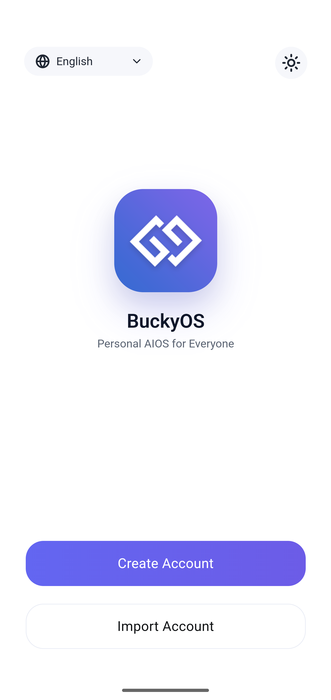 |
| 创建账户说明页 | 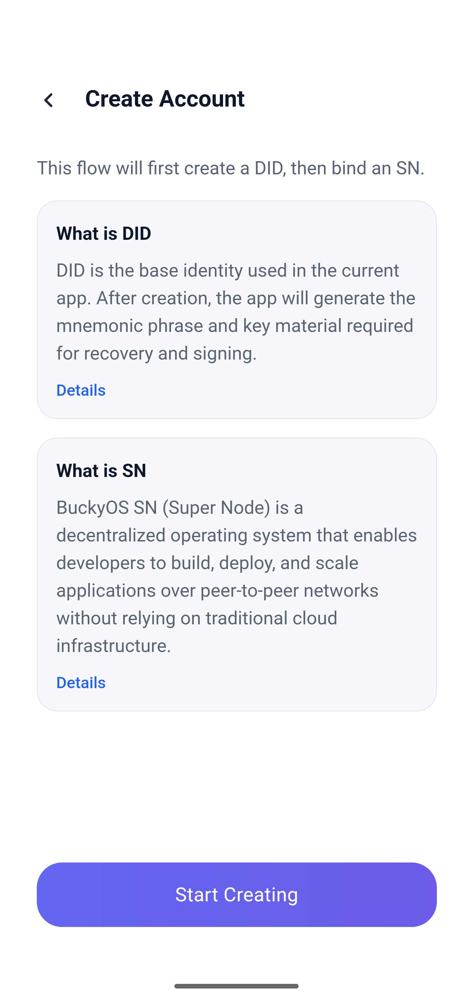 |
| 助记词展示页 |  |
| 助记词确认页 | 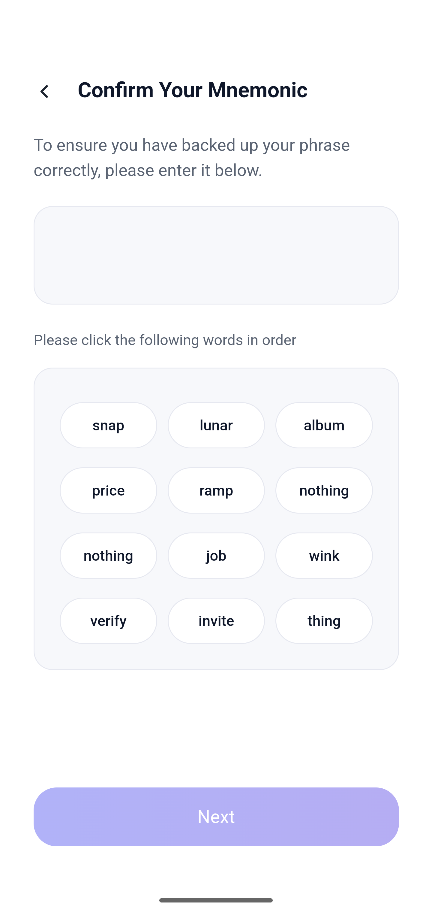 |
| 绑定 SN 页 | 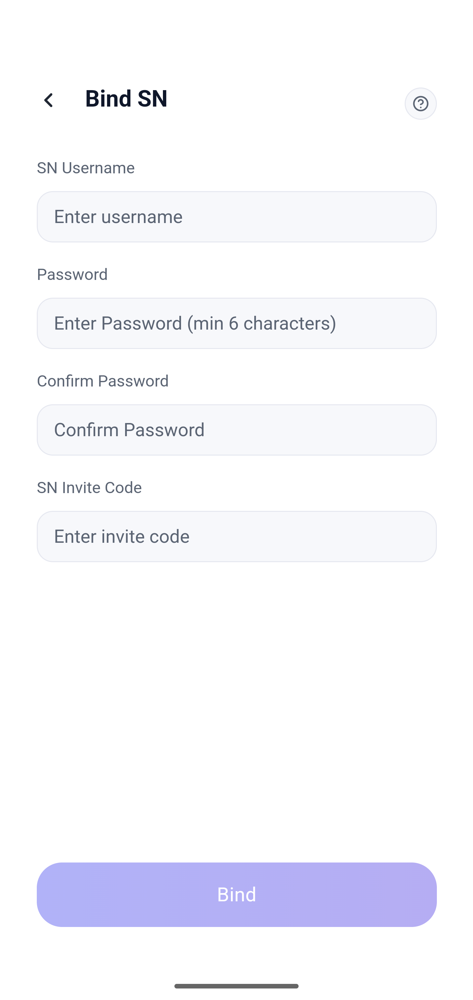 |
| 创建成功页 | 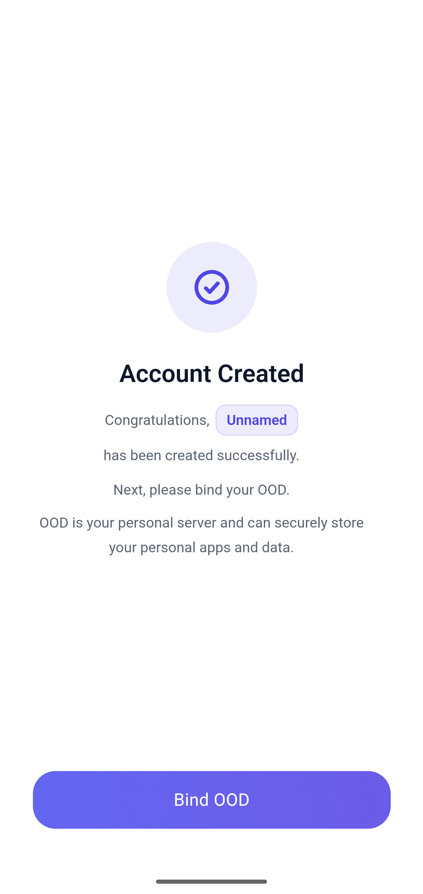 |
| 导入账户页 | 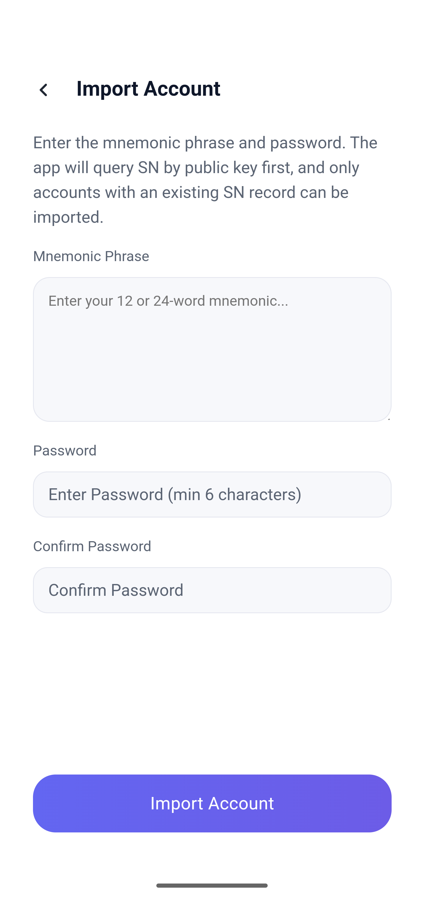 |
| OOD 绑定状态页 | 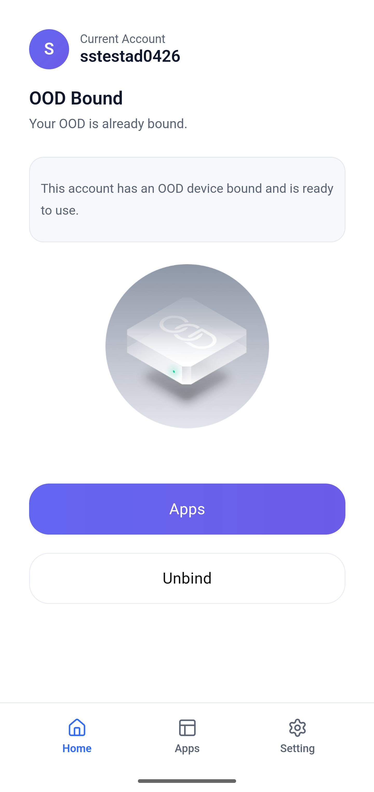 |
| OOD 扫描页 | 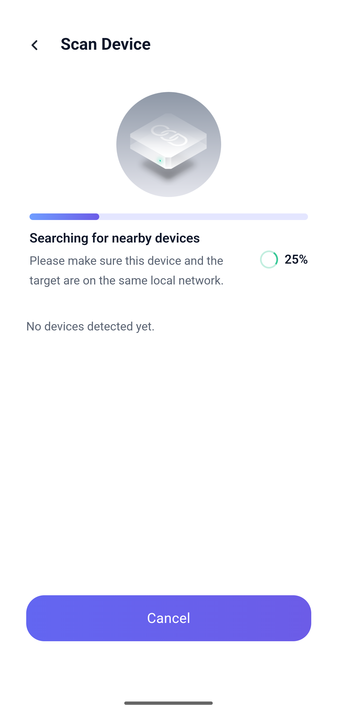 |
| 应用页 | 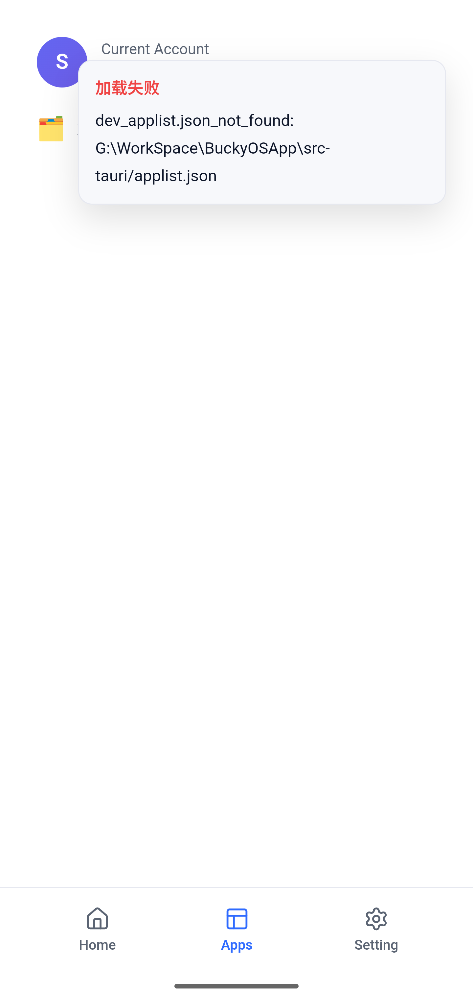 |
| 设置页 | 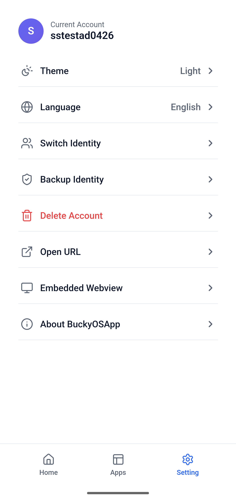 |
| 身份切换页 | 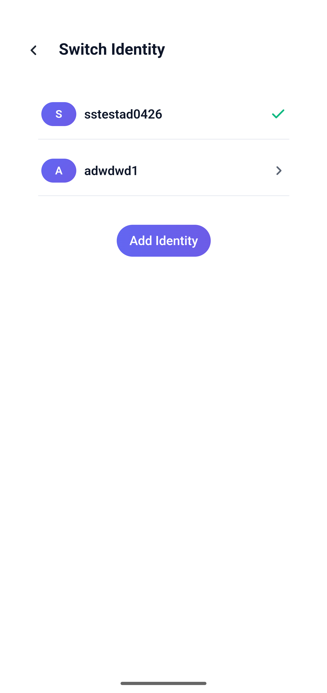 |
| 嵌入式 WebView 测试页 | 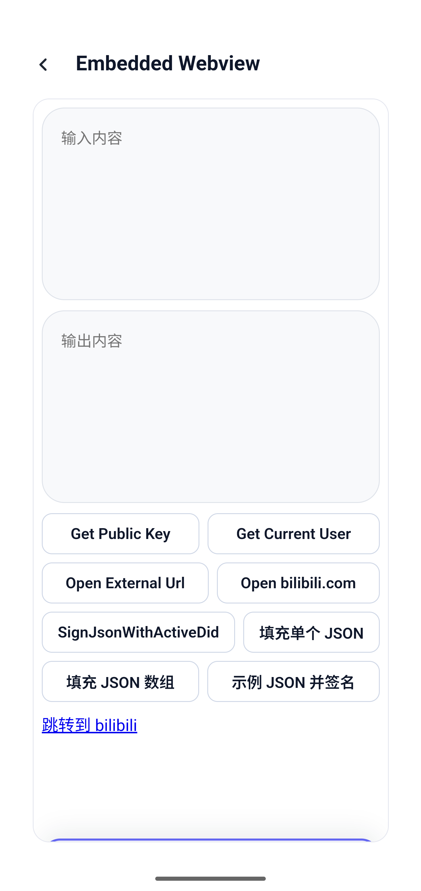 |

页面说明：

- 欢迎页提供创建账户和导入账户两个主入口，同时允许切换语言和主题。
- 创建账户说明页解释当前流程是先准备 DID 材料，再继续绑定 SN。
- 助记词展示页和确认页构成备份确认闭环。
- 绑定 SN 页收集 SN 用户名、统一密码和 Active Code，负责完成 SN 注册和 owner key 绑定。
- 导入账户页只收集助记词和统一密码，不再要求用户手动输入名字。
- OOD 绑定状态页展示当前账户是否已绑定 OOD；未绑定时同一路径展示激活入口，已绑定时展示进入应用和解绑入口。
- OOD 扫描页用于扫描局域网设备，并打开设备激活页。
- 应用页当前只展示应用元数据，不承担安装、启动或升级。
- 设置页承载语言、主题、身份切换、备份、删除、关于和调试入口。
- 嵌入式 WebView 测试页用于验证 `BuckyApi` 注入、宿主桥接和 iframe 输入框键盘避让。

## 3. 当前版本定位

BuckyOS App 当前承担两类职责：

- 身份宿主：管理本机 DID 的创建、导入、切换、备份、删除，以及 DID 维度的 SN 状态缓存。
- Runtime 宿主：为嵌入式 iframe 或独立 WebView 提供受控的宿主能力，并向页面注入 `window.BuckyApi`。

当前版本不是完整应用商店，也不是完整 OOD 生命周期管理器。它更接近一个“身份入口 + 运行容器”。

### 3.1 功能等价边界

本文档的目标不是要求源码级复刻，而是要求另一个实现能交付功能相同、数据兼容、协议兼容的 App。技术栈可以替换，但以下外部行为和兼容性边界必须保持一致：

- 路由和页面能力需要覆盖第 6 节列出的产品结构。
- DID、助记词、密钥、签名、加密、SN 密码摘要和本地持久化数据必须与第 10 节兼容，否则会影响账户恢复、SN 绑定、Runtime 签名和历史数据读取。
- SN 远端调用的方法名、参数、成功判定和轮询策略必须与第 11 节兼容，否则会影响创建、导入和 OOD 绑定状态判断。
- Runtime 对第三方页面暴露的 `window.BuckyApi` 能力和返回结构必须与第 12 节及 [BuckyApi.md](./BuckyApi.md) 兼容。
- Android 安全区、键盘避让和 iframe 输入框避让必须达到第 13 节描述的用户可见效果。

当前代码的实现参考如下：

- 前端使用 React 单页应用、hash router、Vite。
- 宿主使用 Tauri 2，前端通过 Tauri `invoke` 调用 Rust 命令。
- 主 UI 运行在 Tauri WebView 中，移动端优先，同时支持桌面窗口。
- 前端使用 `buckyos` Web SDK 调用 SN JSON-RPC，并使用其中的 `buckyos.hashPassword`。
- Runtime 注入通过 Tauri 插件的 `js_init_script_on_all_frames` 覆盖所有 frame，注入脚本为 `public/bucky-api.js`。

### 3.2 UI 与状态约束

- 默认 UI 可跟随系统主题；用户可在设置页切换 light/dark，结果保存到 `localStorage` 的 `buckyos.theme`。
- 默认语言可跟随系统语言；用户可在语言页切换，结果保存到 `localStorage` 的 `buckyos.locale`。
- 当前支持语言包括 English、简体中文、繁体中文、西班牙语、法语、德语、韩语、日语、俄语。
- DID 创建流程中的密码、确认密码、助记词、助记词确认顺序、SN 用户名、Active Code、创建结果均为前端内存状态，流程未完成前不持久化。
- 直接刷新或从中间路由重新进入创建流程时，不要求恢复未完成的创建状态。
- 按钮、底部操作区、TabBar 和输入控件必须适配 Android 安全区和键盘 inset，约束见第 13 节。

## 4. 功能范围

### 4.1 已实现范围

- 欢迎页，提供创建账户和导入账户入口。
- DID 说明页。
- 创建账户说明页。
- 助记词生成、展示、确认。
- 创建流程中的 SN 绑定。
- 创建成功页，并引导进入 OOD 激活入口。
- 导入 DID，并在导入前通过公钥查询 SN 记录。
- DID 列表、身份切换。
- 身份备份。
- 身份删除。
- SN 状态持久化缓存。
- OOD 局域网扫描。
- OOD 激活页打开。
- 已绑定 OOD 状态展示和解绑入口。
- App 列表读取与展示。
- 设置页、语言页、关于页。
- 嵌入式 WebView 测试页。
- 移动端独立 WebView 打开外部页面。
- `BuckyApi` 注入与宿主能力桥接。
- Android 安全区和键盘避让，包括同源 iframe 的输入框避让。

### 4.2 当前不在范围

- App 安装、升级、卸载。
- App 点击启动。
- 完整的应用商店运营能力。
- 完整的 OOD 生命周期管理。
- 远程设备激活。
- OOD 激活完成后的全部本地配置写回编排。
- 更细粒度的第三方页面权限授权体系。
- 超出当前宿主桥接能力之外的新 `BuckyApi` 接口。

## 5. 核心术语

- DID：本地身份对象，由助记词派生，包含钱包、公钥、昵称等信息。
- Active DID：当前激活身份。主应用展示、签名、Runtime API 均以它为准。
- Bucky Wallet：DID 下的 Bucky 钱包，当前默认使用第一枚钱包作为 SN 查询、身份展示和签名入口。
- SN：与用户名注册、邀请码校验、公钥查人、zone 信息查询相关的远端服务。
- SN 用户名：SN/BNS 体系中的正式身份名。当前创建流程使用它作为本地 DID 昵称。
- Active Code：SN 创建流程的邀请码，用于当前阶段的开户注册控制。
- OOD：用户设备节点。当前版本主要负责局域网扫描、打开激活页、读取和解绑 zone 绑定状态。
- Runtime：宿主提供给 Web 页面的运行容器，包含嵌入式 iframe 和独立 WebView。
- `BuckyApi`：注入到第三方页面中的宿主 JS API。详细集成说明见 [BuckyApi.md](./BuckyApi.md)。

## 6. 产品结构

### 6.1 路由

DID 流程：

- `/`：欢迎页
- `/did-info`：DID 说明页
- `/sn`：SN 说明页
- `/import`：导入账户
- `/create`：创建账户说明页
- `/show-mnemonic`：展示助记词
- `/confirm-mnemonic`：确认助记词
- `/bind-sn`：绑定 SN
- `/success`：创建成功页

主应用流程：

- `/main/home`：首页，当前承载 OOD 入口和已绑定状态
- `/main/home/ood-activate`：OOD 激活入口
- `/main/home/ood-scan`：局域网扫描页
- `/main/apps`：应用列表页
- `/main/setting`：设置页
- `/main/setting/identities`：身份切换页
- `/main/setting/backup`：身份备份页
- `/main/setting/language`：语言页
- `/main/setting/about`：关于页
- `/main/setting/embedded-webview`：嵌入式 WebView 测试页
- `/web-container`：独立 WebView 容器页

### 6.2 TabBar 规则

TabBar 只在以下路径显示：

- `/main`
- `/main/home`
- `/main/home/ood-activate`
- `/main/apps`
- `/main/setting`

其余二级页不显示 TabBar。

### 6.3 启动规则

- 启动时如果本地不存在 DID，进入 DID 流程。
- 启动时如果本地已存在 DID，进入主应用流程。
- 如果本地有 DID 但没有 Active DID，主应用强制跳转到身份切换页。

## 7. DID 与 SN 创建流程

### 7.1 当前创建流程定义

当前代码采用“两阶段创建”的产品节奏，但本地 DID 的落盘时机以代码为准：

1. 生成助记词。
2. 用户确认助记词。
3. 输入 SN 用户名、密码、确认密码、Active Code。
4. 完成 SN 注册和 owner key 绑定。
5. SN 绑定确认后，才调用 `create_did` 创建本地 DID。
6. 创建出的 DID 自动成为 Active DID。

这意味着当前版本中：

- “点击创建账户”不会立刻创建本地 DID。
- 助记词确认后仍不是账户完成态。
- 只有 SN 注册、owner key 绑定、SN 记录可查询、本地 DID 创建全部完成后，创建流程才完成。
- 创建流程中途退出视为放弃本次未完成流程，不保留恢复继续创建态。

### 7.2 创建账户说明页

页面目标：

- 解释当前流程会先准备 DID 材料，再完成 SN 绑定，最终创建本地 DID。
- 告诉用户 DID 是本地身份，SN 是体系内可识别的名字。
- 不要求用户在本页输入昵称或密码。

当前页面行为：

- 展示 DID 说明卡片。
- 展示 SN 说明卡片。
- DID 卡片可进入 DID 说明页。
- SN 卡片可打开 `https://sn.buckyos.ai/`。
- 点击主按钮后生成助记词并进入助记词展示页。

### 7.3 助记词展示页

页面目标：

- 展示 12 个助记词。
- 明确提示用户离线备份。
- 强调助记词是恢复账户的关键材料。

要求：

- 固定顺序展示。
- 不弱化备份风险。
- 点击确认后进入助记词确认页。

### 7.4 助记词确认页

页面目标：

- 确认用户已经真实完成备份。

当前交互：

- 将助记词打乱形成词池。
- 用户按顺序点击单词。
- 顺序完全一致后，允许进入 SN 绑定页。

### 7.5 绑定 SN 页

页面目标：

- 承接创建流程第二阶段。
- 设置统一密码。
- 注册 SN 用户名。
- 使用 Active Code 完成当前阶段的创建准入。

输入项：

- SN 用户名
- 密码
- 确认密码
- SN 邀请码

本地校验规则：

- 用户名输入会先 `trim`，并统一转为小写。
- 用户名必须匹配正则 `^[a-z][a-z0-9-]{5,}[a-z0-9]$`。
- 用户名长度至少 7。
- 用户名首字符必须是小写英文字母。
- 用户名中间字符只允许小写英文字母、数字和连字符 `-`。
- 用户名末字符必须是小写英文字母或数字。
- 当前代码不允许点号 `.`，也没有连续点号规则。
- 密码长度至少 6。
- 两次密码必须一致。
- Active Code 必填。

远端前置检查：

- 用户名输入后延迟 500ms 调用 `auth.check_username`。
- Active Code 输入后延迟 500ms 调用 `auth.check_active_code`。
- 提交按钮只有在用户名远端检查成功、Active Code 远端检查成功、密码满足规则时才可用。

提交顺序：

1. 再次执行本地校验。
2. 调用 `derive_bucky_public_key` 根据助记词派生 Bucky 公钥。
3. 使用 `buckyos.hashPassword(username, password)` 生成 `pwd_hash`。
4. 调用 `auth.register` 注册 SN 用户名。
5. 调用 `user.bind_owner_key` 绑定 owner 公钥。
6. 轮询 `device.get_by_pk`，直到 SN 记录可见或超时。
7. 调用 `create_did` 创建本地 DID，昵称使用 SN 用户名，密码使用本页输入的统一密码。
8. 按 DID 维度写入 SN 状态缓存。
9. 进入创建成功页。

当前版本没有独立的“绑定确认页”。临时流程文档中提到的 DID Document 绑定语义，在当前代码中通过 `user.bind_owner_key` 和 `device.get_by_pk` 的结果确认体现。

### 7.6 创建成功页

页面目标：

- 告知账户已创建成功。
- 展示 DID 关键信息。
- 引导用户进入 OOD 激活入口。

当前展示：

- 昵称
- BuckyOS DID
- BTC 地址，如果存在
- ETH 地址，如果存在

主按钮行为：

- 进入 `/main/home/ood-activate`。

## 8. 导入 DID 流程

### 8.1 流程目标

导入 DID 用于恢复一个已经完成过 SN 绑定的身份。

导入成功后，系统应实现：

- 使用助记词恢复本地 DID。
- 根据派生出的 Bucky 公钥查询 SN 记录。
- 如果 SN 上存在记录，则使用 SN 返回的用户名作为本地 DID 昵称。
- 导入完成后自动设为 Active DID。

### 8.2 输入项

- 助记词
- 密码
- 确认密码

当前版本不包含：

- 手动输入昵称
- 手动输入 SN 用户名

### 8.3 校验与导入顺序

1. 输入过程中调用 `validate_mnemonic_words` 检查已完成单词是否合法；如果当前输入以空格结尾，检查全部单词，否则检查最后一个仍在输入中的单词之前的内容。
2. 提交时检查助记词非空、密码长度、两次密码一致。
3. 调用 `derive_bucky_public_key` 派生 Bucky 公钥。
4. 调用 `device.get_by_pk` 查询 SN 记录。
5. 如果未查到有效 `user_name`，导入失败。
6. 如果查到 `user_name`，使用该名字作为昵称调用 `import_did`。
7. 导入后刷新该 DID 的 SN 状态缓存。
8. 进入 `/main/home`。

结论：

- 导入 DID 不再要求用户手动输入名字。
- 只有 SN 上存在记录的 DID 才允许导入。
- 同一设备内不允许重复导入同一个 DID。
- 最终导入校验以 Rust `Mnemonic::parse_in(Language::English, phrase)` 为准，会校验 BIP-39 单词数量和 checksum；UI 上不单独要求输入 12 个词或 24 个词。

## 9. 主应用需求

### 9.1 首页和 OOD 激活入口

当前 `/main/home` 与 `/main/home/ood-activate` 都承载 OOD 相关入口。

未绑定 OOD 时：

- 展示 OOD 激活标题和说明。
- 展示 OOD 插图。
- 提供“扫描本地网络内的设备”按钮。
- “激活远程设备”按钮为禁用态，仅提示即将支持。

已绑定 OOD 时：

- 展示 OOD 已绑定状态。
- 提供进入应用页按钮。
- 提供解除绑定入口。

### 9.2 扫描设备页

页面目标：

- 扫描局域网中可以返回激活页的设备。

当前扫描逻辑：

- 调用 `local_ipv4_list` 读取本机 IPv4。
- 过滤 `127.*`。
- 如果同时存在非 `172.*` 地址，则优先排除 `172.*`。
- 根据网段生成目标地址池。
- 按批次调用 `scan_device_batch`。
- 只保留返回了有效 `active_url` 的设备。

设备展示：

- 设备名或 IP
- 设备类型
- 基础系统信息，如果存在
- 显示 IP
- 本机设备标识

点击设备后的行为：

- 如果 `active_url` 是完整 `http(s)` 地址，则直接打开。
- 如果是相对路径，则拼接为 `http://{display_ip或ip}:3182/{path}` 后打开。
- 移动端通过 `/web-container?embedded=1` 在当前 WebView 内打开。
- 桌面端通过独立 `WebviewWindow` 打开。

### 9.3 应用页

页面目标：

- 读取并展示当前可用 App 元数据。

数据来源：

- Tauri 命令 `get_applist`。

当前行为：

- 展示图标或首字母占位。
- 展示应用名。
- 展示应用描述。

当前限制：

- 仅展示，不支持启动、安装、升级、卸载。

### 9.4 设置页

固定入口：

- 语言
- 关于
- 切换身份
- 备份身份
- 删除账户

开发环境入口：

- 打开链接
- 嵌入式 webview

敏感操作规则：

- 备份身份前要求输入密码。
- 删除账户前先确认，再输入密码。

### 9.5 身份切换页

页面目标：

- 展示全部 DID。
- 允许切换 Active DID。
- 提供添加身份入口。

当前规则：

- 当前激活身份显示选中态。
- 点击非当前身份后弹出密码框。
- 使用 `reveal_mnemonic` 作为密码校验。
- 校验通过后调用 `set_active_did`。
- 底部添加身份弹窗提供“创建账户”和“导入账户”。

### 9.6 身份备份页

进入前置条件：

- 从设置页输入密码，并通过 `reveal_mnemonic` 校验。

页面流程：

- 展示助记词。
- 再次确认助记词。
- 完成后返回主流程。

### 9.7 删除账户

删除流程：

1. 弹出风险确认框。
2. 再弹出密码输入框。
3. 调用 `delete_wallet` 删除当前 DID。

删除后的跳转规则：

- 如果本地仍有 DID，进入身份切换页。
- 如果本地已无 DID，返回欢迎页。

## 10. DID 与 SN 数据需求

每个 DID 当前至少包含：

- `id`
- `nickname`
- `bucky_wallets`
- `btc_addresses`
- `eth_addresses`
- `sn_status`

当前前端默认依赖第一枚 `bucky_wallets[0]` 作为：

- SN 查询公钥
- Runtime `getPublicKey` 返回值
- Runtime `getCurrentUser` 的 DID 和 public key 来源
- Runtime 签名默认身份

SN 状态按 DID 维度缓存并持久化。

缓存内容当前包括：

- `username`
- `zone_config`

前端优先读取本地缓存。缓存缺失或需要刷新时，再调用 `device.get_by_pk` 并写回缓存。

### 10.1 当前使用的关键算法

创建和导入 DID 的算法以当前 Rust 代码为准：

- 助记词生成：使用 BIP-39 English word list。
- 助记词熵：创建流程使用 128-bit 随机熵，因此生成 12 个英文助记词。
- 随机源：使用系统随机源 `OsRng`。
- 助记词校验：按 BIP-39 English word list 校验单词是否存在。
- Seed 生成：使用 `bip39::Mnemonic::to_seed(passphrase)`，当前 passphrase 固定传空字符串 `""`。
- 默认 DID 派生计划：当前创建和导入默认只派生 1 个 Bucky identity，即 `WalletRequest::bucky(1)`。
- Bucky identity：通过 `name-lib` 的 `generate_ed25519_key_pair_from_mnemonic(phrase, passphrase, index)` 生成 Ed25519 key pair，默认 index 为 `0`。
- Bucky DID：通过 `name-lib` 的 `get_device_did_from_ed25519_jwk(public_jwk)` 从 Ed25519 public JWK 得到。
- 本地 DID 记录 id：不是密钥派生 DID，而是本地记录 id，格式为 `did:bk:1:<ULID>`。

扩展钱包时使用的算法：

- BTC：由同一 BIP-39 seed 派生 BIP-32 master key，网络固定为 Bitcoin mainnet。
- BTC 派生路径：`m/{purpose}'/0'/0'/0/{index}`。
- BTC address type 与 purpose：
  - Legacy：`44`
  - Nested SegWit：`49`
  - Native SegWit：`84`
  - Taproot：`86`
- 当前默认 BTC 类型常量为 Native SegWit，但默认创建 DID 不会自动生成 BTC 地址。
- ETH：派生路径为 `m/44'/60'/0'/0/{index}`。
- ETH 地址：secp256k1 public key 非压缩形式去掉首字节后做 Keccak-256，取后 20 字节，并按 EIP-55 输出 checksum address。

助记词加密算法：

- 明文：完整 BIP-39 助记词字符串。
- KDF：PBKDF2-HMAC-SHA256。
- 迭代次数：`100000`。
- Salt：16 bytes，使用 `OsRng` 生成，并以 hex 保存。
- 对称加密：AES-256-GCM。
- Nonce：12 bytes，使用 `OsRng` 生成，并以 hex 保存。
- 密文：AES-GCM 输出结果以 hex 保存。
- 当前不会持久化明文助记词、明文密码或私钥 PEM。

签名算法：

- `sign_json_with_active_did` 会先用用户输入密码解密助记词，再重新派生 Active DID 的 Ed25519 private key。
- Runtime JSON 签名使用 JWT/JWS，header algorithm 为 `EdDSA`，底层 key 为 Ed25519。
- `generate_zone_boot_config_jwt` 同样使用 Ed25519 + `EdDSA`，默认 claims 过期时间为当前时间后 10 年。

SN 密码摘要：

- 创建 SN 账户和 Runtime 签名返回的 `pwd_hash` 均由 `buckyos-websdk` 的 `buckyos.hashPassword(username, password)` 生成。
- 当前 [BuckyApi.md](./BuckyApi.md) 中描述的规则为 `Base64(SHA256(password + username + ".buckyos"))`；实现侧以 SDK 函数为准。

### 10.2 当前持久化的数据

本地身份数据通过 `tauri-plugin-store` 保存到 `wallet.store`，当前 store key 为 `vault`。

`vault` 当前结构：

```ts
{
  version: number;
  active_did?: string;
  dids: StoredDid[];
}
```

每个 `StoredDid` 当前保存：

```ts
{
  id: string;
  nickname: string;
  seed: {
    kdf_iter: number;
    kdf_salt_hex: string;
    cipher_nonce_hex: string;
    cipher_hex: string;
  };
  wallets: {
    btc: Record<string, AddressSeries<BtcAddress>>;
    eth: AddressSeries<ChainAddress>;
    bucky: AddressSeries<BuckyIdentity>;
  };
  sn_status?: {
    username?: string;
    zone_config?: string;
  };
}
```

字段说明：

- `active_did`：当前激活 DID 的本地记录 id。
- `id`：本地 DID 记录 id，格式为 `did:bk:1:<ULID>`。
- `nickname`：本地展示名。创建和导入成功后当前使用 SN 用户名。
- `seed`：加密后的助记词材料，只保存 KDF 参数、nonce 和密文。
- `wallets.bucky.entries[]`：Bucky identity 的 `index`、`did`、`public_key`。
- `wallets.eth.entries[]`：ETH 地址的 `index` 和 `address`。
- `wallets.btc`：按 BTC 地址类型分组保存地址序列。
- `AddressSeries.next_index`：下一次扩展该类型地址时使用的起始 index。
- `sn_status.username`：该 DID 关联的 SN 用户名缓存。
- `sn_status.zone_config`：该 DID 关联的 OOD zone 配置缓存。

前端额外持久化到 `localStorage` 的数据：

- `buckyos.locale`：当前 UI 语言。
- `buckyos.theme`：当前 UI 主题，值为 `light` 或 `dark`。

当前不会持久化的数据：

- 明文密码。
- 明文助记词。
- Ed25519 private key PEM。
- SN `auth.register` 返回的 access token 和 refresh token。
- Active Code。
- 用户名/邀请码前置检查结果。
- Runtime 签名弹窗中输入的密码。
- OOD 扫描结果。
- 嵌入式 WebView 测试页输入框内容。

## 11. SN 模块需求

当前前端直接依赖以下 SN 接口：

- `auth.check_username`
- `auth.check_active_code`
- `auth.register`
- `user.bind_owner_key`
- `device.get_by_pk`
- `zone.unbind_config`

接口职责：

- `auth.check_username`：校验 SN 用户名是否可用。
- `auth.check_active_code`：校验 Active Code 是否有效。
- `auth.register`：提交用户名、`pwd_hash`、Active Code，获取 access token。
- `user.bind_owner_key`：把当前 DID 公钥绑定到 SN 用户记录。
- `device.get_by_pk`：按公钥查询 SN 记录，用于导入校验、绑定确认、zone 状态查询。
- `zone.unbind_config`：解绑 OOD zone 配置。

`pwd_hash` 规则：

- 创建和签名相关流程均使用 `buckyos.hashPassword(username, password)`。
- 当前实现依赖 `buckyos-websdk`，不在前端自行拼接自定义摘要逻辑。

### 11.1 SN 接口兼容要求

默认 SN API base URL 为 `https://sn.buckyos.ai/kapi/sn`。当前实现允许通过应用配置目录下的 `config.json` 覆盖：

```json
{
  "sn_host": "https://sn.buckyos.ai/kapi/sn"
}
```

JSON-RPC 路由规则：

- `root` 路由使用 base URL 本身。
- `auth` 路由使用 `${base}/auth`，如果 base 已经以 `/auth` 结尾则直接使用 base。
- `bns` 路由使用 `${base}/bns`，如果 base 已经以 `/bns` 结尾则直接使用 base。
- 每次 SN 请求的超时时间为 10000ms。

当前调用细节：

| 场景 | 路由 | 方法 | 参数 | 成功判定 |
| --- | --- | --- | --- | --- |
| 检查用户名 | `auth` | `auth.check_username` | `{ name }` | 返回 `valid === true`，或返回 `code === 0` |
| 检查 Active Code | `auth` | `auth.check_active_code` | `{ active_code }` | 返回 `valid === true` |
| 注册 SN | `auth` | `auth.register` | `{ name, pwd_hash, active_code }` | 返回 `code === 0` 且包含 `access_token` |
| 绑定 owner key | `bns` | `user.bind_owner_key` | `{ public_key }`，token 使用注册返回的 `access_token` | 返回 `code === 0` |
| 按公钥查用户 | `root` | `device.get_by_pk` | `{ public_key }` | 返回的 `user_name` 是非空字符串 |
| 解绑 zone | `bns` | `zone.unbind_config` | `{ user_name }`，token 使用当前 DID 生成的签名 token | 返回 `code === 0` |

创建流程在 `auth.register` 和 `user.bind_owner_key` 成功后，会轮询 `device.get_by_pk`，最多 20 次，每次间隔 2000ms。轮询成功后使用返回的 `user_name` 和 `zone_config` 写入 DID 维度 SN 状态缓存；轮询超时视为 SN 绑定失败。

`device.get_by_pk` 返回体可包含 `device_info`、`device_name`、`device_sn_ip`、`found`、`public_key`、`reason`、`sn_ips`、`user_name`、`zone_config` 等字段。当前功能只以 `user_name` 作为是否存在 SN 记录的硬判定，以 `zone_config` 作为 OOD 是否绑定的缓存依据。

## 12. Runtime 与 BuckyApi

### 12.1 Runtime 形态

当前有两种运行形态：

- 嵌入式 iframe：设置页中的嵌入式 WebView 测试页使用。
- 独立 WebView 容器：桌面端使用 Tauri `WebviewWindow`，移动端复用 `/web-container?embedded=1`。

宿主通过 Tauri 插件 `js_init_script_on_all_frames` 向所有 frame 注入 `public/bucky-api.js`。

### 12.2 正式 API 文档

第三方页面集成 `window.BuckyApi` 时，以 [BuckyApi.md](./BuckyApi.md) 为正式说明。

当前正式文档覆盖：

- `getPublicKey`
- `getCurrentUser`
- `signJsonWithActiveDid`

当前桥接实现和测试页还包含 `openExternalUrl`。如果该能力需要作为正式对外 API 发布，必须同步补充到 [BuckyApi.md](./BuckyApi.md)。

### 12.3 返回结构

所有宿主接口统一返回：

```ts
{
  code: number;
  message?: string;
  data?: unknown;
}
```

第三方页面只应根据 `code` 做分支处理，不应依赖宿主内部实现细节。

### 12.4 签名交互规则

`signJsonWithActiveDid` 当前要求：

- 只接受对象数组 `payloads`。
- 非对象条目会被过滤。
- 空输入返回 `NoMessage`。
- 调用时弹出密码输入框。
- 同时只允许一个签名流程进行中。
- 密码错误返回 `InvalidPassword`。
- 用户取消返回 `Cancelled`。
- 成功后返回签名结果数组。
- 如果能读取到 SN 用户名，同时返回本次密码对应的 `pwd_hash`。

### 12.5 WebView 容器行为

`openWebView` 用于从主 App 打开外部页面或测试页：

- 如果 URL 不以 `http://` 或 `https://` 开头，默认补 `https://`。
- 标题为空时，从 URL hostname 推导标题。
- 桌面端打开独立 WebView 窗口，窗口内容仍然进入 App 内部 `/web-container` 路由，由该路由承载 iframe。
- 桌面端窗口 label 只保留字母、数字、下划线和连字符；同 label 窗口已经存在时只聚焦，不重复创建。
- 移动端不创建新窗口，直接跳转到 `#/web-container?embedded=1&label=...&src=...&title=...`。
- `/web-container` 默认 iframe 地址为 `/test_api.html`。
- `/main/setting/embedded-webview` 固定嵌入 `/test_api.html`，用于验证 `BuckyApi`、iframe bridge 和底部输入框键盘避让。

## 13. Android 和 WebView 适配需求

### 13.1 安全区

移动端页面必须适配系统状态栏、底部手势条和三键导航区域。

当前约定：

- 根节点通过 CSS 变量承接安全区。
- 页面底部固定按钮和 TabBar 不应被系统导航区域遮挡。

### 13.2 键盘避让

Android 输入框获取焦点并弹出键盘时，输入框不得被键盘遮挡。

当前实现要求：

- Native 层同步 IME inset 到 CSS 变量 `--keyboard-inset-bottom`。
- App 页面根据该变量调整底部 padding。
- 输入框 focus 时调用滚动逻辑，使控件进入可视区域。
- 导入账户、绑定 SN 等底部有输入框的页面必须适配。

### 13.3 iframe 页面键盘避让

嵌入式 iframe 页面和普通 DID 页面不是完全同一个问题。

- 普通 DID 页面的问题在于 App 自身滚动容器没有根据键盘高度调整可视区域。
- iframe 页面的额外问题在于宿主知道键盘高度，但 iframe 内部页面原本不知道该 inset，也不能自动滚动到 iframe 内部输入框。

当前修复策略：

- 外层 WebView/iframe 容器根据 `--keyboard-inset-bottom` 缩小可视高度。
- 对同源 iframe，宿主把键盘 inset 同步到 iframe 的 document。
- 对同源 iframe，宿主绑定 focus 滚动逻辑。
- `test_api.html` 底部保留输入框，用于持续验证嵌入页面输入框不会被键盘遮挡。

第三方页面适配边界：

- 外层 iframe 容器避让对所有页面有效，可以避免 iframe 本身延伸到键盘下面。
- iframe 内部输入框的自动滚动和 CSS 变量注入只对同源页面有效。
- 跨域第三方页面受浏览器同源策略限制，宿主无法访问其 DOM，也无法强制滚动其内部输入框。
- 因此跨域第三方页面如果自身使用固定布局、内部不可滚动容器或自定义输入控件，仍需要页面自身适配 `visualViewport`、安全区和键盘弹出。

## 14. 宿主能力边界

当前实现使用 Tauri 命令承载以下宿主能力。如果复刻实现不使用 Tauri，也需要提供等价能力和等价返回数据。

### 14.1 DID 与钱包能力

| 能力 | 输入 | 输出/行为 |
| --- | --- | --- |
| 生成助记词 | 无 | 12 个 BIP-39 English 单词 |
| 校验助记词单词 | 单词数组 | 返回第一个非法单词；全部合法则返回空 |
| 派生 Bucky 公钥 | 助记词单词数组 | 返回 Bucky identity 的 public JWK |
| 创建 DID | 昵称、密码、助记词单词数组 | 创建本地 DID，设为 Active DID，返回 `DidInfo` |
| 导入 DID | 昵称、密码、助记词单词数组 | 导入本地 DID，设为 Active DID，返回 `DidInfo` |
| 扩展钱包 | 密码、DID id、钱包类型和数量 | 为指定 DID 追加 BTC/ETH/Bucky 钱包并返回 `DidInfo` |
| 判断钱包是否存在 | 无 | 本地是否已有 DID |
| 列出 DID | 无 | `DidInfo[]` |
| 读取 Active DID | 无 | 当前 Active DID 或空 |
| 设置 Active DID | DID id | 指定 DID 的 `DidInfo` |
| 删除 DID | 密码、可选 DID id | 密码验证通过后删除指定 DID；未传 id 时删除 Active DID |
| 备份助记词 | 密码、可选 DID id | 解密并返回助记词单词数组 |
| 当前昵称 | 无 | Active DID 的 nickname 或空 |

`DidInfo` 的功能字段至少包括：

```ts
{
  id: string;
  nickname: string;
  btc_addresses: { address_type: string; index: number; address: string }[];
  eth_addresses: { index: number; address: string }[];
  bucky_wallets: { index: number; did: string; public_key: unknown }[];
  sn_status?: { username?: string; zone_config?: string };
}
```

### 14.2 SN 状态和签名能力

| 能力 | 输入 | 输出/行为 |
| --- | --- | --- |
| 列出 SN 状态缓存 | 无 | 返回以 DID id 为 key 的 SN 状态 map |
| 写入 SN 状态缓存 | DID id、`username`、`zone_config` | 写入该 DID 的 SN 状态 |
| 清除 SN 状态缓存 | DID id | 清除该 DID 的 SN 状态 |
| 使用 Active DID 签名 JSON | 密码、对象数组 | 返回 JWT/JWS 字符串数组；单项签名失败时该项为空 |
| 生成 OOD boot config JWT | 密码、可选 DID id、可选 SN、可选 OOD 名称 | 返回 EdDSA JWT，claims 包含 `oods`、可选 `sn`、`iat`、10 年后的 `exp` |

### 14.3 App、网络和配置能力

| 能力 | 输入 | 输出/行为 |
| --- | --- | --- |
| 读取 App 列表 | 无 | 从 `$BUCKYOS_ROOT/bin/applist.json` 读取，失败时回退到仓库内 `applist.json` |
| 读取本机 IPv4 | 无 | 返回非 loopback IPv4 列表，去重并排序 |
| 批量扫描设备 | IP 字符串数组 | 并发请求 `http://{ip}:3182/device`，只返回包含有效 `active_url` 的设备 |
| 读取 SN API host | 无 | 从应用配置 `config.json` 的 `sn_host` 读取，缺省为默认 SN API base URL |

App 列表条目的功能字段至少包括 `pkg_name`、`show_name`、可选 `app_icon_url`、`selector_type`、`install_config_tips`、`pkg_list`，其他字段需要透传显示层可用的元数据。

后续页面和文档不应假设存在当前未实现的新宿主能力。

## 15. 当前版本与临时流程文档的关键对齐

已合并并确认的需求：

- 创建账户必须包含 DID 阶段和 SN 绑定阶段。
- SN 用户名是当前体系内主身份名。
- 创建流程保留用户名密码体系。
- Active Code 是绑定 SN 的必填项。
- 只有 DID 和 SN 都完成后，账户才算创建完成。
- 导入 DID 时不手动输入名字。
- 导入 DID 必须先根据 public key 查询 SN。
- 查不到 SN 记录时导入失败。
- 导入成功后使用 SN 用户名作为本地 DID 昵称。

以当前代码修正后的口径：

- 当前版本不是先落盘本地 DID 再绑定 SN，而是在助记词确认后先绑定 SN，绑定确认后再调用 `create_did`。
- 当前版本没有单独的绑定确认页。
- 当前版本没有独立的 DID Document 展示或确认页。
- 当前首页没有独立 SN 卡片，主要承载 OOD 入口和 OOD 绑定状态。

## 16. 测试约定

手工测试统一使用：

- 密码：`111111`
- 用户名：测试人员自行设置，需满足 SN 用户名规则。

可用 Active Code：

```text
GTdfOk3KL5jGPDJ0r64E
IXOEaDIJdQzhXBrATHnV
vEeTYECosfSD5TLGNQhQ
zYKltgl6hXgO9lFLxhpI
bwhfrnmL2Dl4Fb6SfxfC
ToFRjIl2TzGOkfC8b4QO
csFfeWUfMKiY6ivUwO84
mK7lJ8hG9fD0sA1pO2iU
```

基础验收建议：

- 新设备或清空数据后，能从欢迎页进入创建账户。
- 创建账户可以生成、展示、确认助记词。
- 绑定 SN 页会校验用户名、密码、Active Code。
- SN 绑定成功后能进入成功页并进入 OOD 入口。
- 已绑定 SN 的助记词可以通过导入账户恢复。
- 未绑定 SN 的助记词导入失败。
- 设置页能进入身份切换、备份、删除流程。
- 嵌入式 WebView 测试页能调用 `BuckyApi`。
- Android 底部输入框和同源 iframe 底部输入框在键盘弹出时不被遮挡。

## 17. 文档维护规则

以下内容变化时必须同步更新本文档：

- DID 创建和导入流程。
- SN 绑定提交顺序。
- SN 接口方法名或参数。
- 首页是否重新引入 SN 模块。
- OOD 激活和解绑方式。
- Runtime 运行形态。
- `BuckyApi` 对外接口。
- Android 安全区或键盘避让策略。
- 宿主能力集合。

## 18. 功能等价验收清单

另一个实现只要满足以下条件，即可认为与当前 App 功能等价：

- 能完成创建账户：生成助记词、确认助记词、校验 SN 用户名和 Active Code、注册 SN、绑定 owner key、确认 SN 记录可查询、创建本地 DID、进入成功页。
- 能完成导入账户：输入已绑定 SN 的助记词和密码，派生公钥，查到 SN `user_name` 后导入；查不到 SN 记录时失败。
- 能在本地管理 DID：启动分流、展示 Active DID、切换身份、备份助记词、删除身份、无 Active DID 时引导到身份列表。
- 能持久化并读取兼容的 DID vault 数据，不持久化明文助记词、明文密码、私钥 PEM、Active Code、SN token 和 Runtime 签名弹窗密码。
- 能展示 OOD 入口和绑定状态，能扫描局域网设备，能打开设备 `active_url`，能使用签名 token 解绑 zone 配置。
- 能读取并展示 App 列表，但不需要实现安装、启动、升级、卸载。
- 能提供嵌入式 iframe 和独立 WebView 容器，并向页面提供兼容 [BuckyApi.md](./BuckyApi.md) 的 `window.BuckyApi`。
- Android 上安全区和键盘避让可用，导入账户、绑定 SN、嵌入式 `test_api.html` 底部输入框在 Pixel 4 XL 级别视口下不会被键盘遮挡。
- 浅色主题和 English UI 下的主要页面视觉结构与第 2 节截图一致，允许技术实现不同，但页面信息、主要入口、交互顺序和错误边界必须一致。
